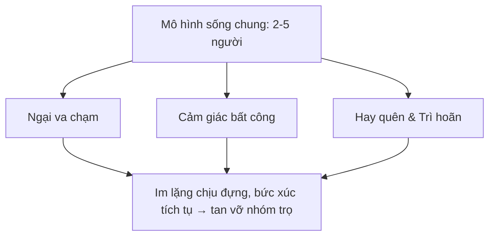
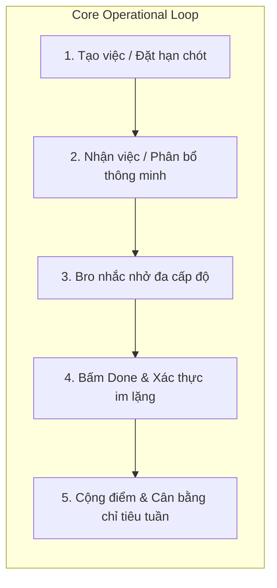
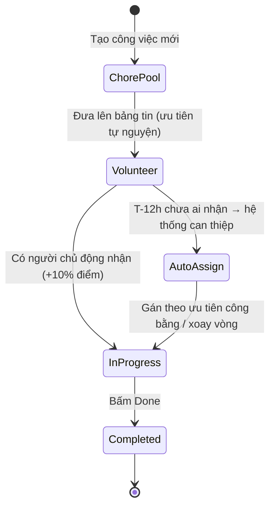
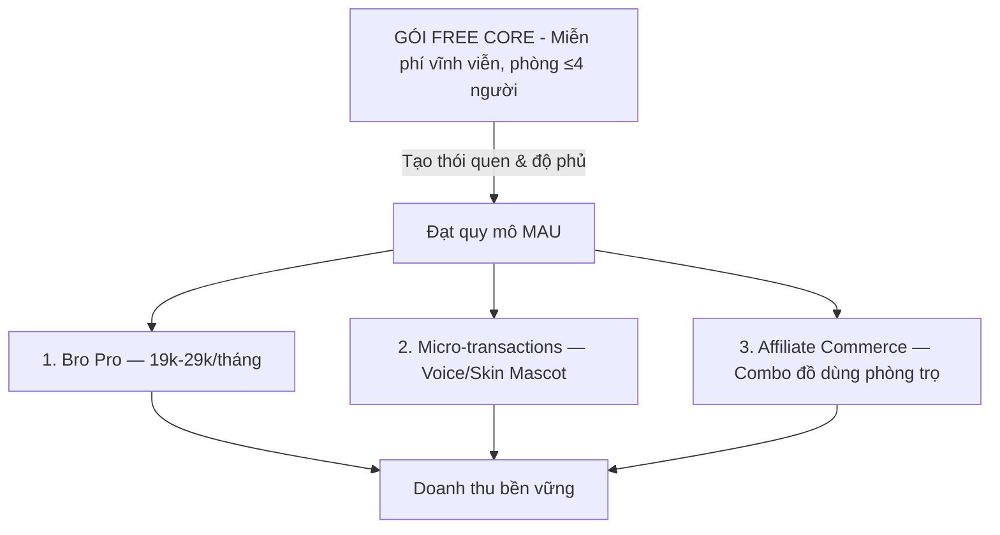
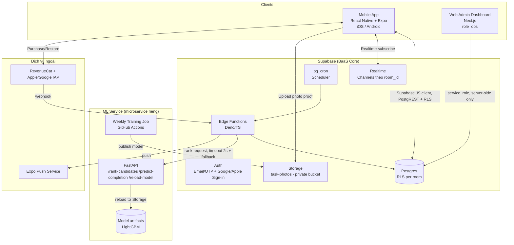
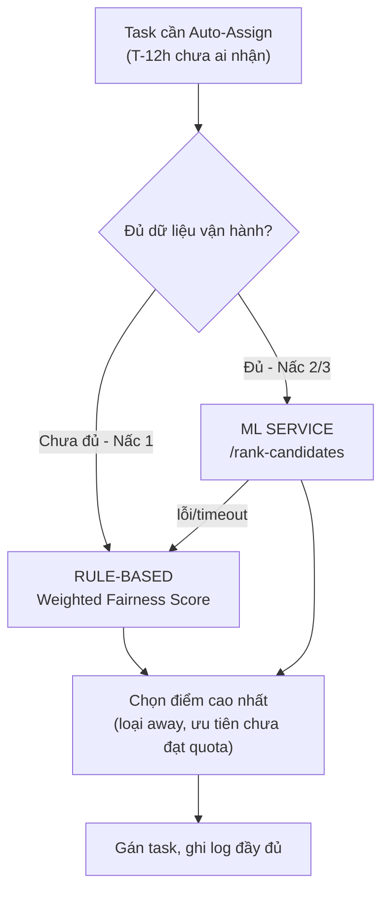
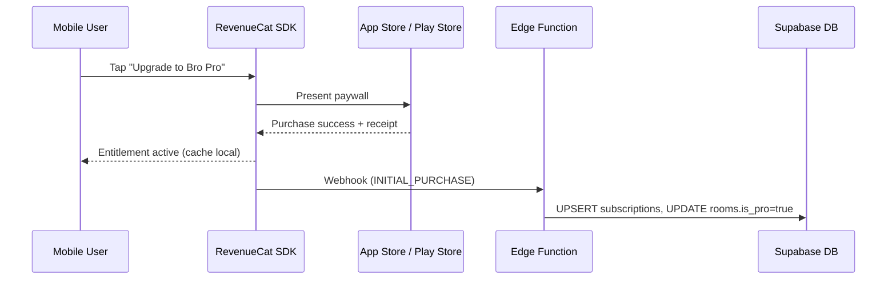
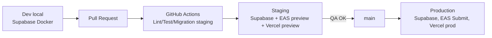

<div align="center">

# 🟣 DUE BRO
### *"Bro, it's due."*

**Người bạn trung gian công tâm cho mọi phòng trọ, căn hộ thuê chung & ký túc xá.**

Ứng dụng số hoá trách nhiệm sống chung — chia việc nhà công bằng, nhắc hạn chót hoá đơn, và biến nghĩa vụ nhàm chán thành trải nghiệm vui vẻ, đúng gu Gen Z.

[](#)
[](#)
[](#)
[](#)

`#7C3AED` Electric Purple · `#181818` Đen than · `#FAFAF9` Trắng kem

</div>

---

## 📑 Mục lục

1. [Vấn đề & Tầm nhìn](#-1-vấn-đề--tầm-nhìn)
2. [Bối cảnh thị trường](#-2-bối-cảnh-thị-trường-ước-tính)
3. [Chân dung người dùng (Personas)](#-3-chân-dung-người-dùng-personas)
4. [Value Proposition Canvas — Từ nỗi đau đến giải pháp](#-4-value-proposition-canvas--từ-nỗi-đau-đến-giải-pháp)
5. [Sản phẩm: Các phân hệ tính năng](#-5-sản-phẩm-các-phân-hệ-tính-năng)
6. [Mô hình kinh doanh (Business Model Canvas)](#-6-mô-hình-kinh-doanh-business-model-canvas)
7. [Kiến trúc kỹ thuật](#-7-kiến-trúc-kỹ-thuật)
8. [Chỉ số đo lường thành công](#-8-chỉ-số-đo-lường-thành-công-north-star-metrics)
9. [Roadmap](#-9-roadmap)
10. [Đội ngũ dự án](#-10-đội-ngũ-dự-án)
11. [Giấy phép & Liên hệ](#-11-giấy-phép--liên-hệ)

---

## 🎯 1. Vấn đề & Tầm nhìn

Sống chung — dù là phòng trọ sinh viên, căn hộ thuê chung của dân đi làm, hay ký túc xá — luôn âm ỉ sinh ra **3 loại mâu thuẫn** mà không ai muốn nói ra:

| # | Mâu thuẫn | Hệ quả |
|---|---|---|
| 1 | **Ngại va chạm** khi phải nhắc bạn cùng phòng làm việc nhà / đóng tiền | Im lặng chịu đựng, bức xúc tích tụ âm thầm |
| 2 | **Cảm giác bất công** vì đóng góp không được ghi nhận | "Tôi làm nhiều hơn bạn" — không có bằng chứng, dễ thành tranh cãi ngầm |
| 3 | **Hay quên & trì hoãn** dẫn đến deadline sinh hoạt bị bỏ lỡ | Tiền điện/nước/internet bị cắt, bị chủ trọ phạt |



Đây không phải là những vấn đề nhỏ — đây là **nguyên nhân phổ biến nhất khiến các nhóm ở ghép tan rã**. Và không có công cụ nào trên thị trường Việt Nam giải quyết trọn vẹn cả ba cùng lúc.

### Tầm nhìn

**Due Bro** định vị là **"Người bạn trung gian công tâm" (The Neutral Bro)** — sản phẩm số hoá trách nhiệm sống chung, tự động hoá việc nhắc nhở, và biến nghĩa vụ nhàm chán thành trải nghiệm tương tác nhẹ nhàng, vui vẻ.

> Trung tâm của trải nghiệm là **mascot Bro** — người anh em phòng bên cool ngầu, đeo kính đen, hóm hỉnh, công bằng, nhưng sẵn sàng "cà khịa" nhẹ khi bạn trễ hạn. **Mọi lời nhắc đều đến từ Bro — không từ người thật trong phòng.** Đây chính là insight cốt lõi làm nên sản phẩm: khi người nhắc không còn là con người, gánh nặng "làm kẻ khó tính" biến mất.

**Sứ mệnh cốt lõi:**
1. **Xoá bỏ gánh nặng "kẻ hay nhắc nhở"** — mascot Bro đứng ra nhắc thay tất cả mọi người.
2. **Minh bạch hoá & định lượng hoá đóng góp** — thay cảm tính bằng hệ thống điểm minh bạch, có dữ liệu.
3. **Đồng bộ toàn diện đời sống trọ** — cả việc nhà định kỳ lẫn hạn chót tài chính sống còn.

---

## 📊 2. Bối cảnh thị trường *(số liệu ước tính / tham khảo)*

> Due Bro đang ở giai đoạn **MVP / pre-seed**, chưa có dữ liệu người dùng thật. Các con số dưới đây là số liệu thị trường vĩ mô đã research, dùng để minh hoạ quy mô cơ hội — **không phải số liệu vận hành nội bộ.**

| Chỉ dấu thị trường | Số liệu (ước tính) | Ý nghĩa với Due Bro |
|---|---|---|
| Quy mô sinh viên đại học Việt Nam | ~2.355.711 người (năm học 2023–2024) | Phần lớn sống xa nhà → nhóm SAM chính (Persona "sinh viên ở trọ") |
| Quy mô Gen Z Việt Nam | ~15 triệu người, ~25% lực lượng lao động, đóng góp ~40% chi tiêu ngoài gia đình | Nhóm sẵn sàng chi trả cho tiện ích cá nhân hoá |
| Phổ cập smartphone | 84%, phủ sóng 4G 99% | Hạ tầng đủ chín muồi cho app mobile-first |
| Lượt tải ứng dụng tại VN (2025) | ~2,88 tỷ lượt | Thị trường mobile app sôi động, hành vi cài app đã phổ biến |

**Khoảng trống thị trường:** Splitwise chỉ giải bài toán chia tiền, không chia việc nhà. Các app chia việc nhà quốc tế (OurHome, Tody, Sweepy...) không bản địa hoá tiếng Việt, không có cơ chế ẩn danh, không tích hợp hạn chót hoá đơn kiểu Việt Nam. **Due Bro là sản phẩm đầu tiên gộp cả ba: chia việc nhà công bằng + nhắc hạn chót hoá đơn + cơ chế ẩn danh bảo vệ tình bạn**, được thiết kế bản địa ngay từ đầu.

---

## 👥 3. Chân dung người dùng (Personas)

Due Bro được thiết kế cho **3 chân dung người dùng** — hai nhóm nhân khẩu học và một phân khúc hành vi cắt ngang cả hai, chính là nơi sản phẩm tạo ra khác biệt lớn nhất.

<table>
<tr><th width="33%">👩‍🎓 Persona 1 — "Lan"<br/>Sinh viên ở trọ</th><th width="33%">👨‍💻 Persona 2 — "Khoa"<br/>GenZ đi làm, thuê chung</th><th width="34%">🤐 Persona 3 — "Vy"<br/>Người hướng nội <em>(lõi)</em></th></tr>
<tr>
<td>

**Tuổi:** 19–22
**Bối cảnh:** SV năm 2, ở ghép 3–4 người gần trường
**Ngân sách:** hạn chế, phụ gia đình + làm thêm
**Công nghệ:** quản lý mọi thứ qua Messenger/Zalo, chưa quen app tổ chức cuộc sống

**Pain:** chưa biết chia việc công bằng; sợ bị đánh giá "ở dơ"; ngại nói thẳng; tiếc tiền trả phí app

**Gain:** có ai trung lập nhắc thay mình; thấy rõ ai làm gì; không tốn thời gian họp phân việc

*"Tao không dám nói bạn cùng phòng dọn dẹp, sợ mất lòng, nên thôi tự làm luôn cho xong."*

</td>
<td>

**Tuổi:** 22–27
**Bối cảnh:** nhân viên văn phòng, thuê chung căn hộ 2–3 người
**Ngân sách:** ổn định, sẵn sàng trả phí cho tiện ích
**Công nghệ:** dùng nhiều app số hoá cuộc sống (ví điện tử, đặt đồ ăn...)

**Pain:** không có thời gian nhắc nhau; thấy bất công khi người bận vẫn gánh việc nhiều hơn; mất kiên nhẫn nhắn tin nhắc lại

**Gain:** tự động hoá hoàn toàn phân việc; có báo cáo/lịch sử minh bạch; không phải làm "người xấu"

*"Đi làm cả ngày rồi về nhà, tao không có sức để nhắc ai đổ rác nữa."*

</td>
<td>

**Tuổi:** 19–26 (cắt ngang 2 nhóm trên)
**Đặc điểm:** cực kỳ ngại xung đột, thà im lặng chịu đựng còn hơn nói ra
**Hành vi:** tránh đối đầu bằng mọi giá, có xu hướng chuyển trọ/cắt liên lạc thay vì giải quyết

**Pain:** sợ bị ghét nếu lên tiếng; bức xúc tích tụ âm thầm; "lao động vô hình" không được ghi nhận

**Gain:** cơ chế **ẩn danh** để yêu cầu nhắc nhở; giảm tối đa đối thoại trực tiếp về vấn đề nhạy cảm

*"Mình thà chuyển trọ còn hơn phải mở miệng nói bạn cùng phòng dọn dẹp."*

> 🎯 Đây là persona mà **Anonymity Shield** ("Bro ơi, nhắc nhẹ cái") giải quyết trực tiếp nhất — **differentiator cốt lõi** của sản phẩm.

</td>
</tr>
</table>

---

## 💡 4. Value Proposition Canvas — Từ nỗi đau đến giải pháp

### 4.1 Customer Jobs — Việc khách hàng cần hoàn thành

| Loại | Mô tả |
|---|---|
| **Functional** | Giữ không gian sống sạch sẽ; đóng đúng hạn tiền phòng/điện/nước; chia công bằng việc nhà |
| **Social** | Duy trì quan hệ tốt với bạn cùng phòng; không bị coi là "khó tính" hay "ở dơ" |
| **Emotional** | Cảm thấy được đối xử công bằng; không mang cảm giác tội lỗi khi nhắc người khác; giảm căng thẳng khi sống chung |

### 4.2 Pains → Pain Relievers

| 😖 Nỗi đau | 💊 Due Bro giải quyết bằng |
|---|---|
| **The Nagger Burden** — người nhắc bị xem là khó chịu, người bị nhắc thấy bị sai bảo | **Mascot Bro** đứng ra nhắc thay người thật — không ai trong phòng phải làm "kẻ khó tính" |
| **The Invisible Labor** — việc vặt (mua giấy vệ sinh, đổ rác, thay bóng đèn) không được ghi nhận | **Bảng trọng số công việc chuẩn** (Effort Point) ghi nhận mọi việc, kể cả việc phát sinh |
| **Deadline quên lãng** — tiền điện/nước/internet bị quên | **Module Life Deadlines** với nhắc nhở đa cấp độ |
| **Cảm giác thiếu công bằng** — "tôi làm nhiều hơn bạn" không có bằng chứng | **Hệ thống điểm minh bạch** + **Weekly Quota** cho mọi thành viên |
| **Sợ xung đột trực tiếp** | **Anonymity Shield** — nút "Bro ơi, nhắc nhẹ cái" ẩn danh 100% |

### 4.3 Gains → Gain Creators

| 🌟 Mong muốn | 🎁 Due Bro tạo ra bằng |
|---|---|
| Có bên trung lập nhắc nhở | Ma trận leo thang giọng điệu Bro (thân thiện → cà khịa → khẩn cấp) |
| Minh bạch đóng góp | Bảng xếp hạng điểm + lịch sử hoàn thành, xuất báo cáo (gói Pro) |
| Việc nhà bớt nhàm chán | Danh hiệu hài hước theo Karma: *Chúa Tể Đổ Vỏ, Thánh Lau Nhà, Vua Khất Nợ...* |
| Xử lý bất mãn êm đẹp | Quy tắc "khiếu nại lịch sự" — Bro làm trung gian truyền đạt |
| Linh hoạt khi có việc đột xuất | **SOS Swap** (nhờ làm hộ) + **Away Mode** (tạm vắng không bị tính chỉ tiêu) |

### 4.4 Ma trận Pain → Persona → Module

| Pain | Persona ảnh hưởng nhiều nhất | Module giải quyết |
|---|---|---|
| The Nagger Burden | Cả 3, mạnh nhất ở Persona "Vy" | Bro Voice & Notification Engine |
| The Invisible Labor | "Lan", "Khoa" | Smart Chore Engine — bảng trọng số chuẩn |
| Deadline quên lãng | "Lan" (ngân sách hạn chế) | Life Deadlines |
| Cảm giác bất công | "Khoa" (bận rộn, coi trọng công bằng) | Dual-Currency: Effort Score + Bro Karma |
| Sợ xung đột trực tiếp | "Vy" | Anonymity Shield |
| Gian lận tự bấm hoàn thành | Cả 3 (ảnh hưởng lòng tin chung) | Silent Approval 6h + Photo Proof |
| Việc nhà nhàm chán | Cả 3 | Danh hiệu hài hước theo Karma |
| Biến động thành viên | "Lan", "Khoa" | Chính sách "Tân binh" + bàn giao Host an toàn |

---

## 🧩 5. Sản phẩm: Các phân hệ tính năng

MVP (Release 1) gồm **5 module lõi**. Ngoài phạm vi MVP: cổng thanh toán trong app, OCR hoá đơn, chợ đồ cũ nội bộ — dành cho Phase 2.



### 🧹 Phân hệ 1 — Smart Chore Engine (Quản lý & phân bổ việc nhà)

Ba loại công việc: **Định kỳ** (đổ rác, rửa bát, dọn WC theo lịch), **Phát sinh/SOS** (hết nước uống, bóng đèn cháy), và **Hạn chót sinh hoạt** (tiền phòng, điện, nước — nhắc hạn chứ chưa xử lý giao dịch tiền trong MVP).

Bảng điểm chuẩn tham khảo (người dùng tuỳ biến được):

| Công việc | Tần suất gợi ý | Điểm chuẩn |
|---|---|---|
| Đổ rác & thay túi mới | Hàng ngày | 5 pts |
| Rửa chén bát / dọn bếp | Hàng ngày | 15 pts |
| Quét & lau sàn nhà chung | 2–3 ngày/lần | 20 pts |
| Cọ rửa nhà vệ sinh | 1 lần/tuần | 35 pts |
| Nấu ăn cho cả phòng | Theo bữa | 30 pts |
| Tổng vệ sinh cuối tuần | 2 tuần/lần | 50 pts |
| Thay bình nước / mua đồ chung | Phát sinh | 10 pts |

**Cơ chế phân bổ — Quy chế 3 bước cân bằng** (không "gán mù quáng cho người ít điểm", tránh khuyến khích ngâm việc):



1. **Bounty Board** — việc định kỳ lên bảng chung trước 24h, ai chủ động nhận được **+10% điểm**.
2. **Weekly Quota** — mỗi người có chỉ tiêu điểm/tuần (mặc định 60 điểm).
3. **Auto-Assign fallback** — đến T-12h chưa ai nhận, Bro tự gán: ưu tiên người chưa đạt quota → xoay vòng → loại người đang `Away Mode`.

### 🕶️ Phân hệ 2 — Bro Voice & Notification Engine

Linh hồn thương hiệu của sản phẩm: thông báo không khô khan mà mang cá tính một người bạn cùng phòng, **leo thang giọng điệu theo mức độ trễ hạn**.

| Mốc thời gian | Cấp độ | Thông điệp mẫu |
|---|---|---|
| Trước hạn 2h | 🙂 Friendly Nudge | *"Bro ơi, lát nhớ đổ rác trước 21h nhé. Easy 5 points!"* |
| Đúng hạn | 😐 Due Alert | *"Bro, it's due! Đến giờ dọn bếp rồi kìa!"* |
| Trễ 2–6h | 😏 Sarcastic Nudge | *"Bro... mày tính để đĩa mọc nấm men mới rửa hả Bro?"* |
| Trễ > 12h | 🚨 Emergency SOS | *"Task này đang 'đóng băng' rồi. Ai giải cứu được x1.5 điểm!"* |

**🛡️ Anonymity Shield** — nút **"Bro ơi, nhắc nhẹ cái"**: khi một thành viên thấy việc chưa xong/chưa sạch, họ nhắc qua Bro thay vì nhắn trực tiếp. **Hệ thống tuyệt đối không lộ danh tính người yêu cầu** — loại bỏ 100% nguy cơ hiềm khích cá nhân. Đây là tính năng nhạy cảm về lòng tin, áp dụng cùng cơ chế cho cả nút "Chưa sạch" (dispute).

### ✅ Phân hệ 3 — Verification & Anti-Fraud (Xác thực & chống gian lận)

Ngăn chặn tự bấm "Done" để tích điểm khống:

```
[Bấm Done] → (nếu điểm ≥ 30, bắt buộc 1 ảnh minh chứng)
     → [Pending Approval — 6 giờ]
          ├── Không ai khiếu nại → Tự động duyệt & cộng điểm chính thức
          └── Có người bấm "Chưa sạch" → Bro nhắn khéo yêu cầu kiểm tra lại, chưa cộng điểm
```

- **Silent Approval:** điểm ở trạng thái tạm tính trong 6h, tự động chốt nếu không ai phản hồi.
- **Photo Proof:** bắt buộc cho việc điểm cao (≥30 pts).
- **Gentle Dispute:** khi có người bấm "Chưa sạch", Bro gửi thông điệp trung gian, không tiết lộ ai đã bấm.

### 🏆 Phân hệ 4 — Point & Economy Lifecycle (Điểm, quy đổi & vinh danh)

**Hệ thống điểm kép (Dual-Currency):**

| Loại điểm | Chu kỳ | Mục đích |
|---|---|---|
| **Effort Score** | Reset 00:00 thứ Hai hàng tuần | Đo mức hoàn thành chỉ tiêu tuần → danh hiệu *"Tuần này Bro uy tín"* |
| **Bro Karma** | Tích luỹ vĩnh viễn | Đo độ tin cậy dài hạn → mở khoá skin/giọng Bro, huy hiệu, **Thẻ Miễn Làm Việc Nhà** |

Hệ thống danh hiệu hài hước biến bảng xếp hạng thành nội dung vui thay vì áp lực: *Chúa Tể Đổ Vỏ* (đổ rác chăm nhất), *Thánh Lau Nhà* (dọn dẹp đỉnh nhất), *Vua Khất Nợ* (trễ hạn nhiều nhất)...

Phòng còn có thể tự thoả thuận **Room Reward Contract** — ví dụ người điểm thấp nhất tuần khao trà sữa cả phòng.

### 🧑‍🤝‍🧑 Phân hệ 5 — Room & Member Management (Quản trị nhóm & ngoại lệ đời thường)

- **Away Mode:** thành viên vắng nhà (về quê, thực tập xa) → chỉ tiêu tuần đóng băng, không bị gán việc, khối lượng tự chia đều cho người còn active.
- **SOS Swap:** bấm *"Bro ơi, cứu bồ!"* → task lên bảng chung, ai nhận làm hộ được 100% điểm + bonus Karma, người nhờ không bị tính trễ hạn.
- **Onboarding "Tân binh":** thành viên mới giảm 50% chỉ tiêu tuần đầu.
- **Offboarding an toàn:** rời phòng phải bàn giao Host hợp lệ (nếu là Host), lịch sử đóng góp được giữ lại.

### 🔐 Ma trận phân quyền

| Chức năng | Trưởng phòng (Host) | Thành viên |
|---|:---:|:---:|
| Tạo phòng, tạo mã mời | ✅ | ❌ |
| Thêm việc nhà định kỳ & gán điểm chuẩn | ✅ | ✅ (cần Host duyệt) |
| Nhận việc, làm việc, bấm Done | ✅ | ✅ |
| Bật chế độ Tạm vắng | ✅ | ✅ |
| Cài đặt hạn chót hoá đơn | ✅ | ✅ |
| Chỉnh sửa cài đặt phòng / đổi tên mascot | ✅ | ❌ |
| Mời thành viên ra khỏi phòng | ✅ | ❌ |

---

## 💰 6. Mô hình kinh doanh (Business Model Canvas)

Bài toán trung tâm: *"Không ai muốn đứng ra trả 29.000đ cho cả phòng."* Due Bro giải bằng mô hình **3 tầng doanh thu**, khởi động từ một lõi miễn phí đủ mạnh để lan truyền tự nhiên.



| Khối BMC | Nội dung |
|---|---|
| **Customer Segments** | (1) Sinh viên ở trọ/KTX 18–22t · (2) GenZ đi làm thuê chung 22–27t · (3) Người hướng nội/ngại đối đầu — phân khúc lõi cắt ngang. Mô hình multi-sided: mỗi "phòng" có vai trò Host và Member. |
| **Value Propositions** | Xoá gánh nặng "người nhắc nhở" nhờ mascot Bro; minh bạch đóng góp qua điểm số; đồng bộ việc nhà + hạn chót hoá đơn; gamify nghĩa vụ nhàm chán; ẩn danh bảo vệ tình bạn. |
| **Channels** | Viral loop nội tại (bắt buộc mời bạn cùng phòng mới dùng được); nội dung TikTok/Reels theo giọng Bro; hợp tác hội sinh viên/BQL ký túc xá/chủ trọ đông phòng; App Store/Google Play; landing page smoke-test nhu cầu. |
| **Customer Relationships** | Tự phục vụ hoàn toàn qua app (chưa cần CSKH ở giai đoạn đầu); community-led, lan truyền giữa các phòng trọ; cá nhân hoá qua mascot Bro — cảm giác "đồng hành" chứ không "bị giám sát"; hỗ trợ qua fanpage cho gói Pro. |
| **Revenue Streams** | **(a)** Free Core — miễn phí vĩnh viễn ≤4 người, mục tiêu viral. **(b)** Bro Pro — 19.000–29.000đ/tháng (phòng đông người, mở khoá kho giọng Bro, lưu trữ vô hạn, xuất báo cáo). **(c)** Micro-transactions — mua skin/giọng mascot riêng lẻ. **(d)** Affiliate Commerce — hoa hồng Shopee/TikTok Shop/GrabMart khi đặt nhanh đồ dùng phòng trọ ngay từ trong task. |
| **Key Resources** | IP thương hiệu Mascot Bro (thiết kế, kho giọng, cá tính); đội kỹ thuật (mobile, backend, real-time); thuật toán phân bổ công việc; dữ liệu hành vi người dùng; cộng đồng early-adopter làm bàn đạp viral. |
| **Key Activities** | Phát triển & vận hành app (đảm bảo push ≥99.5%); thiết kế trải nghiệm & giọng nói mascot; vận hành tăng trưởng cộng đồng (TikTok, outreach KTX); quản lý đối tác affiliate; bảo mật & cách ly dữ liệu theo phòng (Room Isolation). |
| **Key Partnerships** | Sàn TMĐT/giao hàng (Shopee, TikTok Shop, GrabMart); trường ĐH, KTX, hội sinh viên làm kênh phân phối; đối tác hạ tầng cloud/push notification; đối tác thanh toán cho gói Pro; (tuỳ giai đoạn) studio âm thanh/diễn viên lồng tiếng cho các phiên bản giọng Bro. |
| **Cost Structure** | Chi phí phát triển & vận hành kỹ thuật là khoản lớn nhất; chi phí sản xuất nội dung/giọng mascot (đầu tư "value-driven" vì là differentiator chính); chi phí marketing/growth; chi phí vận hành đội ngũ. MVP nghiêng **cost-conscious** để free tier bền vững, nhưng **value-driven** ở trải nghiệm mascot. |

> 💵 **Định giá tham chiếu:** giá Bro Pro 29.000đ/nhóm/tháng tương đương ~10–20% giá trị khách hàng đo được (~263.600đ/nhóm/tháng) — định vị "rẻ hơn nhiều lần giá trị mang lại", không phải mức giá áp đặt.

---

## 🏗️ 7. Kiến trúc kỹ thuật

> Team quy mô 1–2 dev, timeline MVP 2–3 tháng. Toàn bộ lựa chọn kiến trúc được tối ưu cho việc **một đội nhỏ giao hàng nhanh mà không phải đánh đổi chất lượng nền tảng** (bảo mật, khả năng mở rộng dữ liệu, khả năng nâng cấp AI dần dần).

### 7.1 Sơ đồ kiến trúc tổng quan



**Nguyên tắc chủ đạo:** đọc dữ liệu đơn giản đi thẳng qua Supabase client (PostgREST + RLS), không viết Edge Function riêng cho mọi thứ. Chỉ dùng Edge Function/RPC khi có tác dụng phụ nhạy cảm (tính điểm, gán việc), cần bypass RLS có kiểm soát, hoặc tích hợp bên thứ ba.

### 7.2 Tech Stack

| Layer | Công nghệ |
|---|---|
| Mobile | React Native + Expo, TypeScript, Expo Router, EAS Dev Client |
| UI | NativeWind (Tailwind cho RN), design tokens dùng chung với Admin Web |
| State/Data | TanStack Query + Supabase JS client (cache + realtime invalidation) |
| Push | expo-notifications + Expo Push Service |
| Backend | Supabase — Postgres, Auth, Realtime, Storage, Edge Functions (Deno/TS), pg_cron |
| ML Service | Python, FastAPI, LightGBM, scikit-learn — container riêng, tách khỏi Supabase |
| Admin Web | Next.js (App Router), Tailwind, Server Components — deploy Vercel |
| Monetization | RevenueCat SDK + Apple/Google IAP |
| Monitoring | Sentry (runtime error), PostHog (funnel/retention), Supabase Dashboard |
| CI/CD | GitHub Actions, EAS Build/Submit/Update, Vercel auto-deploy |

### 7.3 Mô hình dữ liệu — nguyên tắc thiết kế

- **Room Isolation triệt để:** mọi bảng bật Row Level Security (RLS); người dùng chỉ thấy dữ liệu của `room_id` mà mình là thành viên, qua hàm `is_room_member()`.
- **Sổ điểm append-only duy nhất** cho cả Effort Score (tuần) và Bro Karma (vĩnh viễn) — tránh race condition khi nhiều task hoàn thành cùng lúc, tuần mới tự bắt đầu từ 0 nhờ `group by week_start`, không cần "xoá" điểm cũ.
- **Anonymity Shield ở tầng dữ liệu:** bảng `nudge_requests` và `disputes` **không có RLS SELECT** cho client thường — chỉ lộ qua view đã lọc cột nhạy cảm (`nudge_counts`, `disputes_public`). Admin nội bộ (role=ops) mới đọc được đầy đủ qua `service_role` server-side để xử lý report nghiêm trọng.
- **Cộng điểm chỉ qua một cổng duy nhất** — RPC `approve_task` (`SECURITY DEFINER`, transaction atomic), đảm bảo mỗi task chỉ được duyệt & cộng điểm đúng một lần, chống gian lận từ gốc kiến trúc.
- **Feature phục vụ AI** tổng hợp qua Materialized View (`mv_member_features`) refresh định kỳ, thay vì một bảng riêng phải đồng bộ thủ công — đơn giản hoá vận hành cho team nhỏ.

### 7.4 Kiến trúc AI/ML — Lộ trình 3 nấc thang

Bài toán: khi không ai chủ động nhận việc (Auto-Assign fallback), cần **xếp hạng** thành viên phù hợp nhất theo khả năng hoàn thành đúng hạn *và* sự công bằng khối lượng. Due Bro chủ động đi theo lộ trình tăng dần độ phức tạp, để một đội nhỏ không phải "vừa xây app vừa xây ML" cùng lúc:



| Nấc | Phương pháp | Khi nào |
|---|---|---|
| **Nấc 1 — Rule-based** | Weighted Fairness Score, công thức tường minh trong Edge Function | MVP launch — deterministic, giải thích được ngay, không cần dữ liệu train |
| **Nấc 2 — Pointwise Classifier** | LightGBM dự đoán xác suất hoàn thành đúng hạn, kết hợp trọng số công bằng | Sau MVP, khi đã tích luỹ đủ dữ liệu vận hành thật |
| **Nấc 3 — Learning-to-Rank** | LightGBM LambdaMART (pairwise ranking) | Khi đã có đủ lịch sử ranking thật qua nhiều tháng vận hành Nấc 2 |

**Vì sao đi tuần tự thay vì nhảy thẳng vào mô hình phức tạp nhất:** API contract (`/rank-candidates`) được thiết kế cố định ngay từ Nấc 1, mỗi lần nâng cấp chỉ đổi implementation phía sau — không phải đổi kiến trúc. ML service **không bao giờ là điểm lỗi duy nhất**: mọi lời gọi có timeout + fallback rule-based độc lập chạy được ngay cả khi ML service down.

### 7.5 Bảo mật — điểm nhấn kiến trúc

| Yêu cầu | Giải pháp |
|---|---|
| Cách ly dữ liệu theo phòng | RLS trên mọi bảng, qua hàm `is_room_member()` |
| Ẩn danh nhắc nhở & khiếu nại | Không cấp quyền SELECT bảng gốc cho client; chỉ lộ qua view đã lọc cột; kiểm soát chặt cả kênh Realtime để tránh rò rỉ payload |
| Ảnh xác thực không public | Bucket Storage private, signed URL có thời hạn |
| Admin Web tách biệt hoàn toàn | Phân quyền qua custom claim `role='ops'`, `service_role` chỉ chạy server-side, không bao giờ lộ ra bundle client |
| Chống tự chấm điểm | Silent Approval + Dispute; điểm chỉ ghi qua một cổng RPC duy nhất |
| Thanh toán | RevenueCat + IAP theo đúng yêu cầu App Store Review Guideline 3.1.1 |

### 7.6 Monetization Flow (RevenueCat + IAP)



### 7.7 DevOps & Deployment



| Thành phần | Hosting | CI/CD |
|---|---|---|
| Mobile | EAS Build + EAS Submit | GitHub Actions khi merge `main`; OTA qua `expo-updates` |
| Backend | Supabase (dev/staging/prod tách biệt) | Migration review qua PR, tự động push lên staging |
| ML Service | Railway/Render/Fly.io (container Python) | Deploy Docker; retrain theo lịch tuần |
| Web Admin | Vercel | Auto-deploy khi merge `main` |

### 7.8 Cấu trúc monorepo

```
duebro/
├── apps/
│   ├── mobile/              # Expo app
│   └── admin/                # Next.js admin dashboard
├── services/
│   └── ml-service/           # FastAPI + LightGBM
├── supabase/
│   ├── migrations/
│   └── functions/            # Edge Functions (Deno)
├── packages/
│   ├── design-tokens/        # màu, font dùng chung mobile + admin
│   └── shared-types/         # types + bro-voice templates
└── .github/workflows/        # CI/CD, weekly retrain job
```

---

## 📈 8. Chỉ số đo lường thành công (North Star Metrics)

| Nhóm chỉ số | Chỉ số | Mục tiêu | Ý nghĩa |
|---|---|---|---|
| Tương tác | **Task Completion Rate** | ≥ 80% | Tỷ lệ công việc được tạo và hoàn thành thực tế |
| Độ đúng hạn | **On-time Completion Rate** | ≥ 75% | Tỷ lệ việc hoàn thành trước/đúng hạn chót |
| Gắn kết | **Room 30-Day Retention** | ≥ 60% | Tỷ lệ nhóm phòng trọ tiếp tục dùng app sau tháng đầu |
| Tăng trưởng | **Viral Coefficient (K-factor)** | ≥ 1.2 | Mỗi phòng mời thêm ít nhất 1 bạn lập phòng mới |

**Yêu cầu phi chức năng nổi bật:** push notification đạt tỷ lệ gửi thành công ≥99.5% với sai lệch không quá 60 giây; thao tác xác nhận hoàn thành việc tối đa 2 lần chạm; toàn bộ dữ liệu điểm số/hình ảnh/lịch sử chỉ truy cập được trong đúng phòng trọ của mình.

---

## 🗺️ 9. Roadmap

### MVP — 2–3 tháng, 1–2 dev

| Giai đoạn | Nội dung |
|---|---|
| Khởi động | Setup nền tảng kỹ thuật, thiết lập môi trường build native ngay từ đầu, thiết lập CI/CD, design tokens, đăng nhập |
| Room & Member | Quản lý phòng & thành viên, mô hình dữ liệu đầy đủ |
| Smart Chores | Template việc nhà, Bounty Board, nhận việc, sinh việc định kỳ tự động |
| Bro Voice & Verification | Hệ thống nhắc nhở leo thang, luồng xác thực hoàn thành (Silent Approval + Dispute + Anonymity Shield), auto-assign rule-based (Nấc 1) |
| Point Economy | Sổ điểm, reset tuần, Karma, bảng vinh danh, Away Mode, SOS Swap |
| Monetization & Admin | RevenueCat + Bro Pro paywall, Web Admin Dashboard (KPI cơ bản) |
| Hoàn thiện | QA, giám sát lỗi/hành vi người dùng, thử nghiệm nội bộ, chuẩn bị nộp store |

### Post-MVP

- Bật ML Nấc 2 khi đủ dữ liệu vận hành thật, sau đó Nấc 3 khi đủ lịch sử ranking.
- Mở rộng **Affiliate Commerce** (Shopee/TikTok Shop/GrabMart).

### Phase 2 (ngoài phạm vi MVP)

- Cổng thanh toán/chuyển tiền trong app (chia tiền phòng) — dự kiến qua **Stripe Connect**.
- OCR quét hoá đơn siêu thị để chia tỷ lệ tiền lẻ tự động.
- Chợ đồ cũ nội bộ giữa các phòng trọ.
- Affiliate Commerce đầy đủ với hoa hồng đơn hàng.

---

## 🧑‍💻 10. Đội ngũ dự án

| # | Họ tên | Vai trò / Phụ trách |
|---|---|---|
| 1 | Phạm Nguyễn Hải Triều | Backend |
| 2 | Mô Ha Mách Bu Ba Ka | Backend |
| 3 | Trần Quốc Huy | AI  |
| 4 | Lương Võ Khôi Quốc | Frontend |
| 5 | Võ Ngọc Ngà | Marketing |
| 6 | Trần Thị Hồng Vân | Business Analysis |

---

## 📄 11. Giấy phép & Liên hệ

Due Bro hiện ở giai đoạn **MVP / pre-seed**. Toàn bộ mã nguồn và tài liệu trong repo này là **tài sản nội bộ**, chưa phát hành công khai dưới bất kỳ giấy phép mã nguồn mở nào.

> 📌 **Lưu ý:** các quyết định kiến trúc chi tiết, đánh giá rủi ro kỹ thuật nội bộ và các câu hỏi nghiệp vụ đang mở được lưu trữ riêng trong tài liệu kiến trúc nội bộ của team, không thuộc phạm vi công khai của README này.

<div align="center">

**Due Bro — Bro, it's due.** 🟣

*Người bạn trung gian công tâm cho mọi phòng trọ.*

</div>