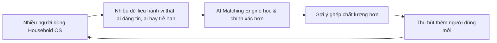
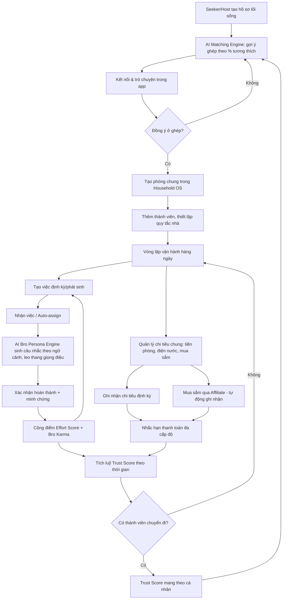

# DUE BRO — Đặc tả Toàn diện Dự án (v2.0 — Post-Pivot)

> Tài liệu này mô tả đầy đủ dự án Due Bro trên giấy tờ: vì sao sản phẩm ra đời, vấn đề gì đang giải quyết, cho ai, bằng cách nào, và kiếm tiền ra sao. Không đề cập chi tiết kỹ thuật/code — dùng làm context đầu vào cho việc viết README, gọi vốn, hoặc cho agent khác tiếp tục phát triển.
>
> **Trạng thái:** Bản pivot sau phản biện của mentor (v1 — "hoà giải mâu thuẫn phòng trọ" — bị đánh giá là giải quyết triệu chứng, không phải nguyên nhân gốc, và TAM/SAM/SOM quá hẹp). Mọi số liệu thị trường được ghi rõ nguồn; chỗ nào là giả định/ước tính chưa kiểm chứng được đánh dấu **[GIẢ ĐỊNH]**.

---

## 0. Tóm tắt điều hành

Due Bro là nền tảng giúp người trẻ **tìm đúng người để sống chung** và **vận hành minh bạch đời sống chung** (việc nhà, tiền bạc, trách nhiệm) sau khi đã dọn vào ở — thay vì chỉ xử lý hậu quả (mâu thuẫn) sau khi đã lỡ ở chung với người không hợp.

Sản phẩm gồm 2 lớp giá trị gắn liền nhau:
1. **Matching theo lối sống** — chọn bạn ở ghép dựa trên sự tương thích hành vi sống (giờ giấc, mức độ gọn gàng, ngân sách...), không chỉ dựa vào giá phòng như hiện nay.
2. **Household OS** — công cụ vận hành hàng ngày (chia việc, chia tiền, nhắc hạn) cho nhóm đã ở chung, đồng thời là nguồn sinh ra **Trust Score** — điểm uy tín cá nhân mang theo qua mỗi lần chuyển trọ, quay lại nuôi cho vòng matching tiếp theo.

Đây là mô hình **"wedge → platform"**: bắt đầu hẹp và thực tế (Household OS, ít rủi ro, dùng được ngay không cần chờ mạng lưới), mở dần sang mạng lưới matching có network effect khi đã đủ dữ liệu người dùng thật.

**Vai trò của AI:** AI không phải tính năng phụ trợ — đây là **bộ não vận hành 2 lớp giá trị cốt lõi** của sản phẩm: (1) tính toán mức độ tương thích lối sống để gợi ý ghép đúng người (AI Matching Engine), và (2) sinh ra giọng điệu nhắc nhở tự nhiên, có ngữ cảnh của Mascot Bro thay vì thông báo cứng nhắc (AI Bro Persona Engine). Đây cũng chính là phần khó sao chép nhất về lâu dài, vì mô hình càng học từ dữ liệu hành vi thật càng chính xác — chi tiết đầy đủ ở Mục 5.

---

## 1. Vấn đề & Nguyên nhân gốc rễ

### 1.1 Vấn đề bề mặt (đã quan sát được)
Người trẻ sống chung (sinh viên ở trọ, GenZ thuê nhà chung với bạn bè/đồng nghiệp) thường xuyên xảy ra căng thẳng xoay quanh việc nhà và tiền bạc chung.

### 1.2 Vì sao "mâu thuẫn" KHÔNG phải là vấn đề để giải trực tiếp
Bản pivot đầu tiên của dự án nhắm thẳng vào việc "hoà giải mâu thuẫn" và bị đánh giá là chưa đủ nghiêm trọng: phần lớn mâu thuẫn ở mức độ nhẹ vẫn giải quyết được bằng cách nói chuyện trực tiếp, không cần công cụ. Mâu thuẫn chỉ là **triệu chứng bề mặt**, không phải nguyên nhân.

### 1.3 Nguyên nhân gốc rễ (đã đào sâu lại)
Hai nguyên nhân gốc dẫn đến mâu thuẫn tích tụ:
- **(a) Matching mù quáng:** Hiện tại người ta chọn bạn ở ghép gần như ngẫu nhiên — qua tin đăng, giới thiệu quen biết — dựa chủ yếu vào giá phòng và vị trí, gần như không có thông tin về sự tương thích lối sống trước khi dọn vào ở chung.
- **(b) Thiếu công cụ vận hành minh bạch:** Một khi đã ở chung, không có cơ chế công bằng để phân chia trách nhiệm (việc nhà) và trách nhiệm tài chính (tiền phòng, điện, nước, mua sắm chung) — gánh nặng "phải làm người nhắc nhở" khiến người có trách nhiệm cao bị coi là khó tính, và đóng góp không được ghi nhận minh bạch.

Mâu thuẫn không phải vấn đề cần giải — nó là **hậu quả tự nhiên** khi (a) và (b) không được xử lý. Giải đúng gốc là: giúp chọn đúng người từ đầu, và cung cấp công cụ vận hành công bằng khi đã ở chung.

---

## 2. Chân dung người dùng (Personas)

Sản phẩm phục vụ 3 vai trò trong cùng một hành trình, không phải 3 nhóm tách biệt:

### Persona A — "Seeker" (Người tìm chỗ ở/bạn ở ghép)
| Thuộc tính | Mô tả |
|---|---|
| Đặc điểm | Sinh viên mới lên thành phố học, người đi làm mới chuyển việc/chuyển thành phố, người cần tìm bạn ở ghép thay thế sau khi người cũ chuyển đi |
| Pains | Chọn bạn ở ghép gần như "may rủi"; lo ngại an toàn khi ở chung người lạ; không có thông tin về lối sống của đối phương trước khi dọn vào |
| Gains mong muốn | Tìm được người hợp lối sống nhanh chóng; cảm giác an toàn, có xác thực; giảm thiểu rủi ro phải chuyển trọ lại vì chọn nhầm người |

### Persona B — "Host" (Người có sẵn phòng, cần tìm thêm người ở ghép)
| Thuộc tính | Mô tả |
|---|---|
| Đặc điểm | Người đang thuê phòng/căn hộ, có chỗ trống cần tìm thêm người chia tiền thuê |
| Pains | Không biết sàng lọc người lạ thế nào ngoài việc nhắn tin qua lại; sợ chọn nhầm người gây phiền phức sau này |
| Gains mong muốn | Có hồ sơ/điểm uy tín để đánh giá nhanh trước khi gặp mặt; công cụ để không phải tự soạn quy tắc nhà từ đầu |

### Persona C — "Operator" (Hộ đã ở chung, cần vận hành hàng ngày)
| Thuộc tính | Mô tả |
|---|---|
| Đặc điểm | Nhóm 2–5 người đã dọn vào ở chung (sinh viên hoặc người đi làm), đang cần công cụ chia việc, chia tiền, nhắc hạn |
| Pains | Gánh nặng làm "người nhắc nhở"; đóng góp không được ghi nhận minh bạch; quên hạn chót tiền phòng/điện/nước; không có cách xử lý bất mãn mà không gây tổn hại quan hệ |
| Gains mong muốn | Vận hành tự động, minh bạch; không phải đối đầu trực tiếp khi cần nhắc nhau; tích luỹ uy tín để dùng cho lần tìm trọ tiếp theo |

> Ghi chú: Một người dùng thực tế thường đi qua cả 3 vai trò theo thời gian (Seeker → Operator → Seeker lần nữa khi chuyển trọ) — đây chính là vòng lặp giữ chân người dùng dài hạn của sản phẩm.

---

## 3. Mức độ cấp thiết & Quy mô thị trường (TAM/SAM/SOM)

### 3.1 Vì sao đúng lúc (bối cảnh thị trường)
- Việt Nam đạt tỷ lệ phổ cập smartphone 84%, phủ sóng 4G 99%, với 2,88 tỷ lượt tải ứng dụng trong năm 2025, xếp thứ 11 thế giới — hạ tầng số đã đủ chín muồi cho một sản phẩm mobile-first.
- Cả nước ghi nhận khoảng 85,6 triệu người dùng Internet, tương đương tỷ lệ thâm nhập 84,2%.
- Gen Z Việt Nam có khoảng 15 triệu người, chiếm khoảng 25% lực lượng lao động quốc gia nhưng đóng góp tới 40% chi tiêu bên ngoài gia đình — nhóm có xu hướng chi trả cho tiện ích cá nhân hoá.

### 3.2 Đánh giá trung thực về mức độ cấp bách **[GIẢ ĐỊNH — cần kiểm chứng thêm]**
Cần nói thẳng: mức độ "cấp bách" của vấn đề này ở cấp độ cá nhân **không cao bằng** các vấn đề tài chính/sức khoẻ cấp thiết khác — phần lớn người dùng chưa từng chủ động tìm kiếm giải pháp cho vấn đề này (chưa có hành vi trả tiền quan sát được trong thị trường Việt Nam). Tính cấp thiết ở đây chủ yếu đến từ **khoảng trống thị trường** (chưa có giải pháp bản địa hoá tốt) hơn là từ mức độ đau đớn hàng ngày của người dùng. Đây là rủi ro lớn nhất của dự án và cần được validate qua khảo sát/smoke-test trước khi đầu tư sâu.

### 3.3 TAM / SAM / SOM
| Cấp độ | Định nghĩa | Ước tính | Nguồn |
|---|---|---|---|
| **TAM** | Gen Z tại Việt Nam (nhóm tuổi có khả năng sống chung ngoài gia đình cao nhất) | ~15.000.000 người | Tạp chí Công Thương |
| **SAM** | Sinh viên đại học cả nước (nhóm chắc chắn sống xa nhà, xác suất ở ghép cao) + một phần GenZ đi làm thuê nhà chung **[GIẢ ĐỊNH tỷ lệ GenZ đi làm ở ghép — chưa có số liệu chính thức]** | ~2.350.000 sinh viên (số cứng) + phần GenZ đi làm **[THIẾU số liệu]** | Bộ GD&ĐT (qua báo Thanh Niên/Giáo dục & Thời đại) |
| **SOM** | Mục tiêu người dùng hoạt động (MAU) trong 1–3 năm đầu, giới hạn ở 1–2 thành phố lớn khởi điểm | 1.000 → 5.000 → 10.000 MAU (theo mốc trong mô hình doanh thu đã dựng) | Nội bộ nhóm — mục tiêu, không phải số đo thị trường |

---

## 4. Value Proposition Canvas (VPC)

### 4.1 Customer Profile

**Customer Jobs (việc cần hoàn thành):**
- Tìm được người ở ghép phù hợp, đáng tin cậy, nhanh và an toàn.
- Vận hành chi tiêu và trách nhiệm chung một cách minh bạch, công bằng.
- Duy trì mối quan hệ tốt với người sống chung.
- Xây dựng "hồ sơ uy tín" cá nhân để việc tìm chỗ ở lần sau dễ dàng hơn.

**Pains (nỗi đau):**
- Matching mù quáng — chọn người ở ghép chủ yếu dựa vào giá phòng, gần như không biết trước về lối sống.
- Rủi ro an toàn khi ở ghép với người lạ, không rõ lai lịch.
- Gánh nặng "người nhắc nhở" (Nagger Burden) — ai đứng ra nhắc bị coi là khó tính.
- Lao động vô hình (Invisible Labor) — việc vặt không tên không được ghi nhận.
- Quên hạn chót tài chính chung (tiền phòng, điện, nước).
- Không có "điểm uy tín" nào chứng minh bản thân là người ở ghép tốt — phải gây dựng lại niềm tin từ đầu mỗi lần chuyển trọ.

**Gains (điều mong muốn):**
- Chọn đúng người ngay từ đầu, giảm mâu thuẫn tận gốc thay vì xử lý hậu quả.
- Có hồ sơ uy tín tích luỹ, giúp lần tìm chỗ ở tiếp theo nhanh và dễ hơn.
- Vận hành minh bạch, tự động, không phải đối đầu trực tiếp.
- Cảm giác an toàn, tin tưởng khi bắt đầu sống chung với người mới.

### 4.2 Value Map

**Products & Services:**
- Module Hồ sơ & Gợi ý ghép theo lối sống (lifestyle matching).
- Household OS: chia việc, chia tiền, nhắc hạn cho nhóm đã ở chung.
- Hệ thống Trust Score — điểm uy tín tích luỹ qua thời gian sử dụng.
- Mascot "Bro" — lớp trải nghiệm/giọng điệu xuyên suốt toàn bộ sản phẩm.

**Pain Relievers:**
| Pain | Pain Reliever |
|---|---|
| Matching mù quáng | Hồ sơ lối sống chi tiết + gợi ý mức độ tương thích trước khi kết nối |
| Rủi ro an toàn | Trust Score công khai + xác thực từng bước (roadmap Phase 2) |
| Nagger Burden | Mascot Bro đứng ra nhắc nhở thay người thật trong nhóm |
| Invisible Labor | Bảng trọng số công việc chuẩn, ghi nhận cả việc vặt phát sinh |
| Quên hạn chót tài chính | Module Life Deadlines nhắc đa cấp độ theo mức độ trễ hạn |
| Phải gây dựng lại niềm tin mỗi lần chuyển trọ | Trust Score mang theo (portable), không mất đi khi đổi phòng |

**Gain Creators:**
- Gợi ý ghép theo % tương thích lối sống (giờ giấc, ngân sách, mức độ gọn gàng).
- Vòng lặp tự củng cố: dùng tốt ở Household OS → Trust Score cao → matching tốt hơn ở lần sau.
- Danh hiệu/huy hiệu hài hước (Karma) làm nhẹ nhàng hoá trải nghiệm vận hành hàng ngày.
- Toàn bộ luồng (tìm người → dọn vào ở → vận hành → chuyển đi) nằm trong một sản phẩm duy nhất, không phải chắp vá nhiều công cụ rời rạc (đăng tin + Splitwise + group chat nhắc việc).

---

## 5. AI Engine — Bộ não công nghệ của Due Bro

> Đây là phần trả lời trực tiếp câu hỏi "AI nằm ở đâu": Due Bro không phải app quản lý task thông thường được gắn mác AI cho có — 2 bài toán cốt lõi của sản phẩm (chọn đúng người để ở ghép, và giao tiếp nhắc nhở sao cho không gây khó chịu) đều là bài toán mà **cách tiếp cận rule-based/thủ công không giải tốt bằng AI**, và đây cũng là phần biện minh cho việc thu phí.

### 5.1 Vì sao AI là phần "ăn tiền", không phải tính năng trang trí
- Nếu bỏ AI ra, Due Bro chỉ còn là app to-do-list gắn mascot — không có gì để thu phí cao hơn các app to-do miễn phí có sẵn.
- Giá trị người dùng trả tiền thực chất là: **"tìm đúng người nhanh hơn, chính xác hơn tự mình đoán"** (AI Matching) và **"được nhắc theo cách dễ chịu, đúng lúc, không nhàm chán"** (AI Bro Persona) — cả hai đều là bài toán cá nhân hoá theo dữ liệu, đúng bản chất của AI.

### 5.2 AI Matching Engine — gợi ý ghép theo lối sống
| Yếu tố | Mô tả |
|---|---|
| Input | Hồ sơ lối sống khai báo (giờ giấc sinh hoạt, ngân sách, mức độ gọn gàng, sở thích, giờ giới nghiêm khách...) + dữ liệu hành vi thực tế thu thập được từ Household OS một khi người dùng đã từng ở trong hệ thống (tần suất hoàn thành việc đúng hạn, mức độ chủ động nhận việc, lịch sử thanh toán đúng hạn) |
| Cách tiếp cận ở MVP | **Rule-based scoring + similarity đơn giản** (tính độ tương đồng giữa các vector đặc trưng lối sống, ví dụ cosine similarity) — chưa cần mô hình học sâu vì chưa có đủ dữ liệu quan sát thực tế để huấn luyện |
| Cách tiếp cận ở Giai đoạn 2 | Chuyển sang mô hình **học từ dữ liệu thật** (collaborative filtering / learning-to-rank) huấn luyện trên các cặp đã từng ghép + kết quả thực tế (có mâu thuẫn không, có ở lâu dài không) — đây mới là AI "thật" theo nghĩa cải thiện dần qua dữ liệu, không phải luật cố định |
| Khác biệt với đối thủ | Roomi/SpareRoom/RoomEasy chỉ match dựa trên thông tin **tự khai báo** (self-reported). Due Bro match dựa thêm trên **hành vi đã được xác nhận** (verified behavior) vì đã đo được qua Household OS — dữ liệu này đối thủ không có vì họ không có sản phẩm vận hành sau khi đã ghép. |

### 5.3 AI Bro Persona Engine — giao tiếp cá nhân hoá
| Yếu tố | Mô tả |
|---|---|
| Công nghệ | Mô hình ngôn ngữ lớn (LLM, gọi qua API như Claude/GPT) được cấu hình bằng system prompt định nghĩa cá tính "Bro" (thân thiện → cà khịa nhẹ → nghiêm túc khi leo thang) |
| Input cho mô hình | Loại việc, mức độ trễ hạn, lịch sử tương tác của người nhận (đã bị nhắc bao nhiêu lần, phản ứng ra sao trước đó) |
| Output | Câu nhắc nhở tự nhiên, đúng ngữ cảnh, đúng cá tính thương hiệu — khác hẳn notification tĩnh kiểu "Bạn có việc chưa hoàn thành" của các app đối thủ |
| Vì sao cần AI thay vì set câu mẫu cố định | Câu mẫu cố định gây nhàm sau vài lần dùng, mất đi hiệu ứng "hài hước, gần gũi" là differentiator thương hiệu; LLM cho phép biến hoá vô hạn trong khi vẫn giữ đúng cá tính |
| Chi phí cần lưu ý | Gọi API LLM tốn phí theo lượng token, là **chi phí biến đổi tăng theo số người dùng** — cần giới hạn số lượt gọi ở gói miễn phí để kiểm soát biên lợi nhuận (xem Mục 7.2 và Mục 11) |

### 5.4 AI Trust & Safety (Giai đoạn 2, ngoài phạm vi MVP)
Mô hình phát hiện bất thường (anomaly detection) trên hành vi để nhận diện tài khoản giả/lừa đảo trong quá trình matching người lạ. Không nằm trong MVP vì ở giai đoạn đầu, phạm vi matching còn nhỏ và có thể kiểm duyệt thủ công.

### 5.5 Data Flywheel — vì sao lợi thế AI này khó sao chép theo thời gian

Đây là vòng lặp tự củng cố (compounding advantage): càng nhiều người dùng Household OS, mô hình AI Matching càng chính xác, càng chính xác càng thu hút thêm người dùng — đối thủ chỉ làm matching thuần (Roomi, SpareRoom...) không có nguồn dữ liệu hành vi thật này vì họ không vận hành phần đời sống sau khi đã ghép.

### 5.6 AI xuất hiện ở đâu trong từng gói giá
- **Free:** Matching Lite dùng rule-based scoring (chưa phải ML); Bro Persona Engine dùng LLM nhưng giới hạn số lượt nhắc/ngày để kiểm soát chi phí API.
- **Bro Plus / Household Pro:** Gợi ý ghép không giới hạn bằng mô hình AI đầy đủ (khi đã triển khai ở Giai đoạn 2); Bro Persona Engine không giới hạn lượt, mở khoá nhiều "phiên bản giọng Bro" được cá nhân hoá sâu hơn qua LLM.

---

## 6. Business Model Canvas (BMC)

| Khối | Nội dung |
|---|---|
| **1. Customer Segments** | Mô hình đa phía (multi-sided): Seeker (người tìm chỗ ở/bạn ở ghép), Host (người có phòng cần tìm thêm người), Operator (hộ đã ở chung cần vận hành). Một người dùng thường trải qua cả 3 vai trò theo thời gian. |
| **2. Value Propositions** | Matching theo lối sống thay vì chỉ theo giá phòng; vận hành minh bạch, tự động cho hộ sống chung; uy tín di động (Trust Score) mang theo qua nhiều lần chuyển trọ; toàn bộ hành trình gói gọn trong một sản phẩm duy nhất thay vì nhiều công cụ rời rạc. |
| **3. Channels** | Kênh tự nhiên: viral loop khi mời bạn cùng phòng dùng chung Household OS; nội dung TikTok/Reels theo giọng Bro; hợp tác ký túc xá/hội sinh viên. Kênh thu hút Seeker/Host: hợp tác hoặc tích hợp với các nền tảng đăng tin phòng trọ hiện có để giảm bài toán cold-start giai đoạn đầu; App Store/Google Play; landing page smoke-test để đo nhu cầu trước khi scale. |
| **4. Customer Relationships** | Tự phục vụ (self-service) qua app; quan hệ mang tính cộng đồng (lan truyền tự nhiên giữa các phòng); nội dung uy tín do chính người dùng tạo ra (đánh giá lẫn nhau sau khi ở chung) thay vì đội ngũ phải sản xuất nội dung; hỗ trợ qua kênh cộng đồng cho người dùng trả phí. |
| **5. Revenue Streams** | Xem chi tiết Mục 7 bên dưới. |
| **6. Key Resources** | IP thương hiệu Mascot Bro; đội ngũ kỹ thuật (mobile, backend, hạ tầng real-time, **kỹ sư AI/ML**); **mô hình AI Matching Engine** (thuật toán gợi ý ghép theo lối sống — xem Mục 5); **AI Bro Persona Engine** (tích hợp LLM cho giao tiếp cá nhân hoá); cơ chế xác thực danh tính (Phase 2); **dữ liệu hành vi & Trust Score của người dùng — tài sản huấn luyện AI quan trọng nhất, càng nhiều càng cải thiện độ chính xác matching**; cộng đồng người dùng sớm làm bàn đạp viral. |
| **7. Key Activities** | Phát triển & vận hành app; **huấn luyện, đánh giá và cải tiến mô hình AI Matching dựa trên dữ liệu hành vi thực tế thu thập liên tục**; **quản lý & tối ưu chi phí gọi API LLM cho AI Bro Persona Engine**; vận hành an toàn & kiểm duyệt (trust & safety — xử lý báo cáo, ngăn lừa đảo); vận hành tăng trưởng cộng đồng; quản lý quan hệ đối tác affiliate/đăng tin phòng trọ. |
| **8. Key Partnerships** | Nền tảng đăng tin phòng trọ hiện có (nguồn Seeker/Host ban đầu, giảm cold-start); trường đại học/ký túc xá/hội sinh viên; sàn TMĐT & dịch vụ giao hàng (Shopee, TikTok Shop, GrabMart) cho affiliate; **nhà cung cấp API LLM** (Anthropic/OpenAI hoặc tương đương) cho AI Bro Persona Engine; đối tác xác thực danh tính (eKYC) khi triển khai Phase 2; đối tác thanh toán/ví điện tử. |
| **9. Cost Structure** | Chi phí phát triển & hạ tầng kỹ thuật (lớn nhất); **chi phí gọi API LLM cho AI Bro Persona Engine — chi phí biến đổi tăng tuyến tính theo số người dùng, cần theo dõi cost-per-user sát sao**; chi phí vận hành an toàn/kiểm duyệt (đáng kể do bản chất matching người lạ, tăng dần khi scale); chi phí sản xuất nội dung/giọng nói Mascot Bro (value-driven, là differentiator, không cắt giảm); chi phí marketing/growth. Giai đoạn MVP ưu tiên **cost-conscious**, phần AI + trải nghiệm mascot giữ **value-driven** vì là lợi thế cạnh tranh cốt lõi. |

---

## 7. Mô hình doanh thu & Chi tiết các gói

### 7.1 Nguyên tắc định giá
Giá bán neo theo giá trị thời gian tiết kiệm được, không neo theo chi phí phát triển. Cơ sở tính (đã kiểm chứng bằng số liệu lương tối thiểu vùng I & GSO): mỗi người tiết kiệm khoảng 100 phút/tháng nhờ không phải bàn bạc/nhắc/theo dõi thủ công → giá trị tiết kiệm được của một nhóm 4 người ước tính khoảng 263.600đ/tháng. Phần giá trị AI mang lại (matching chính xác hơn, giao tiếp dễ chịu hơn) là lý do chính đáng để định giá cao hơn một app to-do thông thường.

### 7.2 Các gói cụ thể **[Các mức giá là đề xuất ban đầu, cần kiểm chứng qua smoke-test trước khi chốt]**

| Gói | Giá | Tính năng cụ thể |
|---|---|---|
| **Free (Cơ bản)** | 0đ | Tạo hồ sơ lối sống; xem tối đa 5 gợi ý ghép/tuần; Household OS cơ bản cho nhóm ≤4 người (chia việc, nhắc hạn); Trust Score nội bộ (chỉ hiển thị trong nhóm hiện tại) |
| **Bro Plus** (cá nhân) | ~19.000–29.000đ/tháng | Gợi ý ghép không giới hạn; huy hiệu "Đã xác minh" tăng độ tin cậy hồ sơ; ưu tiên hiển thị hồ sơ trong kết quả tìm kiếm của người khác; xem chi tiết Trust Score của đối phương trước khi kết nối |
| **Bro Household Pro** (theo nhóm) | ~29.000–49.000đ/nhóm/tháng | Mở khoá module chia tiền đầy đủ (tiền phòng, điện, nước, mua sắm chung); lưu trữ lịch sử không giới hạn; xuất báo cáo chi tiêu; mở khoá toàn bộ kho giọng Mascot Bro; hỗ trợ nhóm >4 người |
| **Micro-transactions** | Theo món | Mua skin/giọng Bro riêng lẻ; mua lượt "boost" hồ sơ hiển thị ưu tiên trong kết quả matching (tương tự cơ chế boost của các app hẹn hò) |
| **Affiliate Commerce** | Hoa hồng % trên đơn hàng | Hoa hồng khi người dùng đặt mua đồ dùng chung (giấy vệ sinh, nước rửa chén...) qua Shopee/TikTok Shop/GrabMart ngay từ trong task của app |

### 7.3 Lưu ý về khả năng "tự động hoá" chi tiêu
Cần minh bạch để tránh hiểu lầm: phần lớn chi tiêu chung (tiền phòng, điện, nước — thường chiếm 70–80% tổng chi tiêu của một hộ) **vẫn cần nhập tay**, tương tự Splitwise — không có cách nào tự động biết số tiền nếu không ai nhập vào. Phần **thực sự tự động** chỉ nằm ở nhánh mua sắm qua affiliate (đơn hàng đi qua API sàn TMĐT nên hệ thống tự biết số tiền, không cần nhập tay). Lợi thế cạnh tranh thật sự không phải "không cần nhập liệu" mà là **gộp 2 việc tách rời (quản lý tiền + quản lý việc + tìm người ở ghép) vào một luồng duy nhất**, thay vì người dùng phải dùng nhiều công cụ rời rạc.

---

## 8. Luồng sản phẩm (Workflow)

**Diễn giải luồng:** Người dùng bắt đầu từ việc tạo hồ sơ và tìm người ở ghép (Matching), sau khi ghép thành công thì chuyển sang vận hành hàng ngày (Household OS) — nơi tạo ra phần lớn giá trị sử dụng và tích luỹ Trust Score. Khi có người chuyển đi, Trust Score đã tích luỹ được mang theo, quay trở lại nuôi vòng matching ở lần tìm trọ tiếp theo — đây là vòng lặp giữ chân người dùng dài hạn của sản phẩm. **Hai điểm chạm AI trong luồng** (đánh dấu rõ trong sơ đồ): bước gợi ý ghép (node B) và bước Bro nhắc việc (node G3) — đây chính xác là 2 khoảnh khắc người dùng "cảm nhận được" giá trị AI, chi tiết cơ chế ở Mục 5.

---

## 9. Lộ trình phát triển theo giai đoạn

> Nguyên tắc phân giai đoạn: **MVP chỉ chứa phần chắc chắn tạo ra giá trị ngay và ít rủi ro cold-start nhất** (Household OS + Matching ở dạng đơn giản); phần đòi hỏi hiệu ứng mạng đầy đủ (thuật toán matching thông minh, Trust Score liên phòng công khai) đẩy sang giai đoạn sau, chỉ trình bày như tầm nhìn mở rộng.

### Giai đoạn 0 — Validate (đã/đang thực hiện)
- Phỏng vấn theo hành trình sống tự lập (Journey Map) để xác nhận đúng nguyên nhân gốc.
- Smoke-test landing page đo nhu cầu thật trước khi đầu tư phát triển sâu.

### Giai đoạn 1 — MVP (trình bày với giám khảo)
Tính năng cốt lõi, đủ ấn tượng để demo, không phụ thuộc vào việc phải có sẵn số đông người dùng:
- **Household OS đầy đủ:** tạo phòng, chia việc (định kỳ/phát sinh), phân bổ tự động, nhắc hạn chi tiêu chung, xác nhận hoàn thành có minh chứng, bảng điểm Effort Score + danh hiệu Karma hài hước.
- **Matching Lite:** tạo hồ sơ lối sống, duyệt xem hồ sơ người khác dạng danh sách/thẻ đơn giản, kết nối qua chat cơ bản trong app.
- **Trust Score phiên bản nội bộ:** tính điểm trong phạm vi một phòng, chưa công khai liên phòng.
- Mascot Bro xuyên suốt trải nghiệm làm điểm nhận diện thương hiệu.
- **Phạm vi AI ở MVP:** (1) AI Matching Engine chạy ở mức **rule-based + similarity scoring** — đủ để demo tính năng "gợi ý ghép thông minh" mà không cần dữ liệu huấn luyện lớn; (2) **AI Bro Persona Engine chạy đầy đủ bằng LLM ngay từ MVP** — đây là phần AI dễ triển khai nhất (chỉ cần gọi API, không cần tự huấn luyện mô hình) và cũng là phần **gây ấn tượng trực quan nhất với giám khảo** vì thấy được ngay sự khác biệt so với notification tĩnh.

### Giai đoạn 2 — Sau MVP (gọi vốn tiếp / phát triển thêm)
- **Nâng cấp AI Matching Engine lên mô hình học từ dữ liệu thật** (collaborative filtering/learning-to-rank), huấn luyện trên dữ liệu hành vi thu thập được từ Giai đoạn 1 — đây là lúc AI Matching mới thực sự trở thành lợi thế cạnh tranh khó sao chép (xem Data Flywheel, Mục 5.5).
- Triển khai **AI Trust & Safety** (phát hiện bất thường/tài khoản giả).
- Trust Score công khai, di động qua nhiều lần chuyển trọ (portable reputation).
- Xác thực danh tính (eKYC) để tăng độ an toàn khi kết nối người lạ.
- Mở module chia tiền nâng cao (Bro Household Pro).

### Giai đoạn 3 — Mở rộng dài hạn
- **AI cá nhân hoá sâu hơn:** chủ động đề xuất (proactive suggestions) dựa trên toàn bộ dữ liệu lối sống tích luỹ, không chỉ phản ứng theo yêu cầu.
- Mở rộng đối tượng ra ngoài Gen Z: gia đình trẻ, mô hình coliving.
- Marketplace đồ cũ khi chuyển trọ; tích hợp dịch vụ chuyển nhà/bảo hiểm.
- Hệ sinh thái Trust Score liên kết với đối tác bất động sản/cho thuê.

---

## 10. Lợi thế cạnh tranh & Bối cảnh đối thủ

| Nhóm đối thủ | Đại diện | Làm tốt gì | Khoảng trống Due Bro lấp vào |
|---|---|---|---|
| App chia tiền | Splitwise | Ghi nợ, chia tiền nhóm rất tốt, đã có thị trường thật | Không có matching, không có quản lý việc nhà, không tự động khi mua sắm qua affiliate |
| App chia việc nhà | OurHome, Tody, Sweepy | Chia việc nhà tốt cho gia đình | Không bản địa hoá tiếng Việt, không tích hợp tài chính, không có matching |
| App matching bạn ở ghép (quốc tế) | Roomi (thao tác kiểu Tinder, có xác thực & background check, từng gọi vốn 2 triệu USD seed rồi 11 triệu USD Series A, mở rộng sang London/châu Âu), SpareRoom (có đội ngũ kiểm duyệt tin đăng thủ công), RoomEasy/Roomster (giao diện dạng thẻ/swipe) | Matching theo lối sống, có cơ chế an toàn/xác thực | Chưa có mặt hoặc chưa mạnh tại Việt Nam; quan trọng nhất — không có phần vận hành sau khi đã ghép (chỉ dừng ở bước tìm người, không đi tiếp vào đời sống chung hàng ngày) |
| Kênh đăng tin truyền thống | Các nhóm Facebook "Hội thuê trọ...", trang đăng tin phòng trọ | Nguồn cung tin đăng lớn, quen thuộc | Không có xác thực, không có gợi ý theo lối sống, không có gì sau khi đã ghép |

**Lợi thế cốt lõi của Due Bro:** Là sản phẩm duy nhất nối liền toàn bộ hành trình — từ **tìm người phù hợp** đến **vận hành đời sống chung minh bạch** — trong một sản phẩm, tạo ra vòng lặp dữ liệu (Trust Score) mà không đối thủ nào ở trên có được vì mỗi bên chỉ giải một khúc của hành trình.

---

## 11. Rủi ro & Giả định cần kiểm chứng

| Giả định | Vì sao quan trọng | Cách kiểm chứng |
|---|---|---|
| Người dùng thực sự trả tiền cho matching theo lối sống, không chỉ dùng kênh miễn phí hiện có (Facebook, tin đăng) | Quyết định toàn bộ mô hình doanh thu Seeker/Host | Smoke-test landing page + phỏng vấn willingness-to-pay |
| **AI Matching Engine cần đủ dữ liệu hành vi thật (cặp đã ghép + kết quả) mới học tốt hơn rule-based — nhưng giai đoạn đầu chưa có đủ dữ liệu này (cold-start cho chính mô hình AI, khác với cold-start mạng lưới người dùng)** | Nếu chuyển sang ML quá sớm khi chưa đủ dữ liệu, mô hình có thể kém chính xác hơn cả rule-based đơn giản | Giữ nguyên Matching Lite (rule-based) suốt MVP, chỉ chuyển sang mô hình học từ dữ liệu khi đã tích luỹ đủ số cặp đã ghép + kết quả quan sát (đầu Giai đoạn 2) |
| **Chi phí gọi API LLM cho AI Bro Persona Engine tăng tuyến tính theo số người dùng, có thể ăn mòn biên lợi nhuận nếu không kiểm soát** | Ảnh hưởng trực tiếp đến cost structure và thời điểm hoà vốn | Giới hạn số lượt gọi LLM/ngày ở gói Free; theo dõi chỉ số cost-per-user thực tế ngay từ giai đoạn thử nghiệm; cân nhắc cache/rule-based fallback cho các tình huống lặp lại |
| Sau khi ghép thành công, người dùng tiếp tục dùng Household OS thay vì quay về thói quen cũ (group chat, Excel...) | Quyết định khả năng giữ chân (retention) — điểm yếu lớn nhất của mô hình matching thuần | Theo dõi tỷ lệ dùng tiếp Household OS của nhóm đã match thành công trong giai đoạn thử nghiệm |
| Đủ nguồn cung Seeker/Host ở giai đoạn đầu để matching có giá trị (bài toán cold-start 2 chiều) | Nếu không đủ, tính năng matching sẽ "chết" vì không ai tìm thấy ai | Hợp tác/tích hợp với nền tảng đăng tin phòng trọ hiện có để có sẵn nguồn cung ban đầu, thay vì gây dựng từ số 0 |
| Gộp "chia tiền + chia việc + matching" vào 1 app đủ hấp dẫn để người dùng đổi khỏi thói quen dùng nhiều công cụ rời rạc (Splitwise + group chat) | Quyết định lợi thế cạnh tranh cốt lõi có thật hay không | Hỏi trực tiếp người đang dùng Splitwise/group chat: có sẵn sàng đổi sang 1 app gộp không |
| Mức độ "cấp bách" của vấn đề đủ cao để ưu tiên trong ngân sách chi tiêu của người dùng trẻ | Ảnh hưởng trực tiếp đến tốc độ tăng trưởng và định giá | Khảo sát diện rộng hơn (không chỉ sinh viên cùng trường), đo tỷ lệ đã từng trả tiền cho giải pháp liên quan |

---

## 12. Ghi chú cho đội ngũ / agent tiếp theo

- Đây là bản pivot sau phản biện của mentor có 23 năm kinh nghiệm ngành — trọng tâm đã chuyển từ "công cụ hoà giải mâu thuẫn" (triệu chứng) sang "matching đúng người + vận hành minh bạch" (nguyên nhân gốc).
- Toàn bộ hạ tầng kỹ thuật đã xây ở bản v1 (Smart Chore Engine, Notification Engine, hệ thống điểm) được tái sử dụng cho module Household OS ở bản v2 — không cần xây lại từ đầu.
- Phần **Matching** là phần mới hoàn toàn, cần ưu tiên giữ ở mức đơn giản (Matching Lite) trong MVP để tránh rủi ro cold-start; **không nên** xây thuật toán ghép phức tạp ngay từ đầu.
- **Về AI (xem đầy đủ Mục 5):** MVP chỉ nên triển khai AI Bro Persona Engine (gọi API LLM có sẵn, không cần tự huấn luyện mô hình) — đây là phần AI nhanh làm, chi phí thấp, dễ demo ấn tượng. **Không nên** cố xây mô hình Machine Learning tự huấn luyện cho Matching Engine ở giai đoạn MVP vì chưa đủ dữ liệu — dùng rule-based scoring là đủ và trung thực hơn khi trình bày với giám khảo.
- Mọi số liệu TAM/SAM/SOM và mức độ "cấp bách" trong tài liệu này cần được xem là **giả định cần kiểm chứng**, không phải sự thật đã xác nhận — đây chính là bài học rút ra từ lần pivot đầu tiên.
- Các mức giá ở Mục 7.2 là đề xuất ban đầu dựa trên phép tính giá trị tiết kiệm thời gian, chưa qua kiểm chứng thị trường thật.
