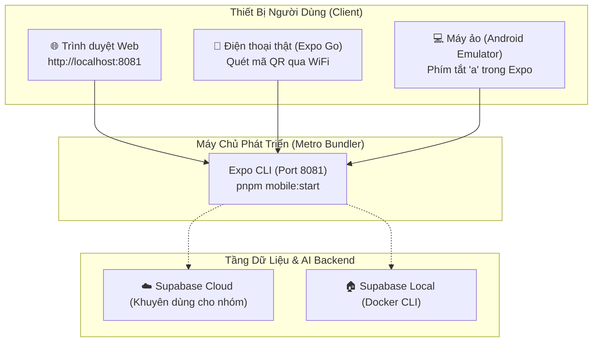

# Cẩm Nang Hướng Dẫn Vận Hành & Khởi Chạy Ứng Dụng Due Bro (`apps/mobile`)

> Tài liệu hướng dẫn chi tiết dành cho lập trình viên, tester và ban giám khảo nhằm khởi chạy ứng dụng di động Due Bro trên mọi nền tảng (Web, Thiết bị thật qua Expo Go, hoặc Máy ảo Android/iOS) và kết nối với Backend Supabase.

---

## 1. Tổng Quan Kiến Trúc Khởi Chạy



---

## 2. Yêu Cầu Tiền Đề (Prerequisites)

1. **Node.js & pnpm:**
   - Node.js $\ge 18$ (máy bạn đang sử dụng Node v24 chuẩn).
   - pnpm $\ge 9$ (máy bạn đang có sẵn `pnpm v12.3.4`).
2. **Thiết bị chạy ứng dụng:**
   - **Cách nhanh nhất:** Trình duyệt Web (Chrome, Edge, Brave...) trên máy tính.
   - **Cách chuẩn di động nhất:** Cài đặt ứng dụng **Expo Go** miễn phí từ Google Play Store (Android) hoặc Apple App Store (iOS).

---

## 3. Bước 1: Cấu Hình Biến Môi Trường (`apps/mobile/.env`)

Hệ thống đã chuẩn bị sẵn file mẫu [`apps/mobile/.env.example`](file:///E:/2026/due_bro_final/apps/mobile/.env.example) và file mặc định [`apps/mobile/.env`](file:///E:/2026/due_bro_final/apps/mobile/.env).

### Tùy chọn A: Kết nối Supabase Cloud (Khuyến khích cho nhóm 4 người)
Nếu bạn đã tạo một Project miễn phí trên [Supabase.com](https://supabase.com):
1. Mở `apps/mobile/.env` và cập nhật:
   ```ini
   EXPO_PUBLIC_SUPABASE_URL=https://your-project-ref.supabase.co
   EXPO_PUBLIC_SUPABASE_ANON_KEY=eyJhbGciOiJIUzI1NiIsInR5cCI6IkpXVCJ9...
   ```
2. Ưu điểm: Cả team 4 người và điện thoại thật đều truy cập chung một database mà không cần cấu hình mạng LAN hay IP máy tính.

### Tùy chọn B: Kết nối Supabase Local (Chạy qua Docker)
1. Chạy Supabase cục bộ trên máy tính:
   ```bash
   npx supabase start
   ```
2. Cập nhật `apps/mobile/.env`:
   - Nếu test trên **Web** hoặc **Android Emulator**:
     ```ini
     EXPO_PUBLIC_SUPABASE_URL=http://127.0.0.1:54321
     EXPO_PUBLIC_SUPABASE_ANON_KEY=sb-anon-token...
     ```
   - Nếu test trên **Điện thoại thật (Expo Go)**:
     Thay `127.0.0.1` bằng địa chỉ IP mạng WiFi của máy tính (xem bằng lệnh `ipconfig` trên Windows, ví dụ `192.168.1.50`):
     ```ini
     EXPO_PUBLIC_SUPABASE_URL=http://192.168.1.50:54321
     EXPO_PUBLIC_SUPABASE_ANON_KEY=sb-anon-token...
     ```

---

## 4. Bước 2: Nạp Dữ Liệu Thử Nghiệm (Seed Data)

Dự án đã chuẩn bị sẵn **18 hồ sơ sinh viên mẫu** chân thực (16 hồ sơ TP.HCM, 2 hồ sơ Hà Nội, đa dạng trường BK, UEH, Y Dược, Ngoại Thương...) tại [`supabase/seed.sql`](file:///E:/2026/due_bro_final/supabase/seed.sql).

- **Nếu dùng Supabase Local:**
  ```bash
  npx supabase db reset
  ```
  *(Lệnh này sẽ tự động chạy lại toàn bộ 16 file migration và nạp toàn bộ seed data)*.

- **Nếu dùng Supabase Cloud:**
  Mở **SQL Editor** trên Supabase Dashboard, copy nội dung của [`supabase/seed.sql`](file:///E:/2026/due_bro_final/supabase/seed.sql) và bấm **Run**.

---

## 5. Bước 3: Khởi Chạy Ứng Dụng Mobile

Tại thư mục gốc dự án (`E:\2026\due_bro_final`), bạn có thể chọn 1 trong 3 cách sau:

### Cách 1: Chạy trực tiếp trên Trình duyệt Web (Nhanh nhất ⚡)
```bash
pnpm mobile:web
```
- Metro bundler sẽ biên dịch và tự động mở trình duyệt tại địa chỉ `http://localhost:8081`.
- Không cần điện thoại hay máy ảo, cực kỳ tiện lợi để review giao diện và chức năng.

---

### Cách 2: Chạy trên Điện thoại thật qua Expo Go (Trải nghiệm chân thực nhất 📱)

#### Tùy chọn 2A: Chế độ Tunnel kết nối xuyên mạng (Khuyên dùng — Không lo tường lửa WiFi)
```bash
pnpm mobile:tunnel
```
- Metro sẽ tạo một đường hầm tunnel an toàn qua Cloudflare/ngrok.
- Điện thoại của bạn dù dùng WiFi khác, mạng công ty, trường học hay 4G/5G đều kết nối được ngay lập tức!
- Mở app **Expo Go** trên điện thoại $\to$ Quét mã QR hiển thị trên terminal máy tính.

#### Tùy chọn 2B: Chế độ mạng nội bộ LAN (Yêu cầu cùng WiFi)
```bash
pnpm mobile:start
```
1. Terminal sẽ hiển thị một **Mã QR Code lớn**.
2. Đảm bảo điện thoại và máy tính **kết nối chung một mạng WiFi**.
3. **Android:** Mở app *Expo Go*, bấm nút **"Scan QR Code"** và hướng camera vào màn hình máy tính.
4. **iOS:** Mở ứng dụng *Camera* mặc định của iPhone, quét mã QR và chọn mở bằng *Expo Go*.
5. Ứng dụng sẽ tải JavaScript bundle về điện thoại trong vài giây!

> [!CAUTION]
> **Lưu ý về phím `a` trên bàn phím máy tính:**
> Phím **`a`** chỉ dành cho người đã cài đặt phần mềm **Android Studio** trên máy tính để mở máy ảo. Nếu máy tính của bạn chưa có Android Studio, **ĐỪNG BẤM PHÍM `a`**, mà chỉ cần mở app Expo Go trên điện thoại để quét mã QR!

---

### Cách 3: Chạy trên Máy ảo Android Studio Emulator (Dành cho Dev Mobile 💻)
1. Cài đặt **Android Studio** trên Windows $\to$ Mở **Device Manager** $\to$ Khởi động máy ảo Android.
2. Chạy lệnh:
   ```bash
   pnpm mobile:android
   ```
   *(Lúc này phím tắt `a` mới có tác dụng)*.

---

## 6. Kịch Bản Trình Diễn Nhanh Trong 3 Phút (3-Minute Live Demo Flow)

Khi ứng dụng đã mở lên màn hình đăng nhập, bạn có thể thực hiện theo kịch bản chuẩn sau:

### Phút 1: Đăng Nhập 1-Chạm Bằng Tài Khoản Hạt Giống
- Tại màn hình đăng nhập, kéo xuống khu vực màu cam: **"⚡ Tài Khoản Demo Nhanh"**.
- Bấm chọn **"👤 Tuấn Kiệt (Ngăn nắp, BK, Trust 92)"** (hoặc Minh Anh IT).
- Bấm **"Đăng nhập vào phòng ⚡"** để vào ngay giao diện chính mà không cần gõ phím.

### Phút 2: Trải Nghiệm 4 Tab Chính
1. **Tab "Việc Nhà" (Bounty Board):**
   - Xem các việc đang mở trong phòng.
   - Bấm thử các chip phân loại: *Dọn dẹp*, *Đổ rác*, *Bếp núc*.
   - Bấm nút **"Nhận việc ⚡ (+10%)"** để kiểm tra cơ chế nhận việc tự nguyện nhận thưởng điểm.
2. **Tab "Tìm Bạn" (Roommate Matcher):**
   - Xem thẻ ứng viên được AI tính toán độ tương thích (ví dụ: `88% MATCH`).
   - Đọc 2 ưu điểm tương thích nổi bật và 1 điểm cần lưu ý.
   - Bấm nút **"Ghép phòng 💚"** hoặc **"Bỏ qua ❌"** để kiểm tra tính năng quẹt thẻ (gọi RPC `swipe`).
3. **Tab "Việc Của Tôi" (My Tasks):**
   - Xem việc vừa nhận từ tab trước.
   - Bấm **"📷 Nộp ảnh"** để mở modal nộp link ảnh bằng chứng hoàn thành.
   - Bấm **"🆘 SOS Đổi việc"** để mở modal phát tín hiệu cứu hộ khẩn cấp kèm chuyển nhượng điểm Karma.
4. **Tab "Bảng Điểm" (Scoreboard):**
   - Xem thanh tiến độ **Quota tuần (Tối thiểu 3 việc/tuần)** giúp tránh đùn đẩy việc.
   - Xem bảng xếp hạng đóng góp của cả phòng và cấp độ tin cậy **Trust Badge**.
   - Bấm nút **"Đăng xuất"** để quay về màn hình ban đầu.

### Phút 3: Thử Nghiệm Luồng Đăng Ký & Khảo Sát 4 Bước
- Bấm **"Đăng ký ngay"** $\to$ Nhập email mới $\to$ Trải nghiệm luồng **Onboarding 4 bước**:
  - Bước 1: Nhịp sinh hoạt (Giờ ngủ / dậy).
  - Bước 2: Độ gọn gàng sạch sẽ (1–5).
  - Bước 3: Ngân sách phòng & Khu vực muốn ở.
  - Bước 4: Thói quen hút thuốc & thú cưng.

---

## 7. Xử Lý Sự Cố Thường Gặp (Troubleshooting)

### 1. Điện thoại không kết nối được máy tính khi quét QR (Lỗi Network Timeout)
- **Nguyên nhân:** Windows Defender Firewall đang chặn cổng 8081 hoặc điện thoại và máy tính không chung subnet mạng WiFi.
- **Cách khắc phục:**
  - Chạy Metro bundler ở chế độ Tunnel:
    ```bash
    pnpm --filter duebro-mobile expo start --tunnel
    ```
  - Hoặc tạm thời cho phép `Node.js` qua Windows Firewall.

### 2. Muốn xóa cache sạch sẽ khi cập nhật giao diện
```bash
pnpm --filter duebro-mobile start -c
```

### 3. Kiểm tra lỗi TypeScript trước khi commit
```bash
pnpm mobile:typecheck
```
*(Kết quả chuẩn phải là exit code 0, không có lỗi type mismatch)*.
