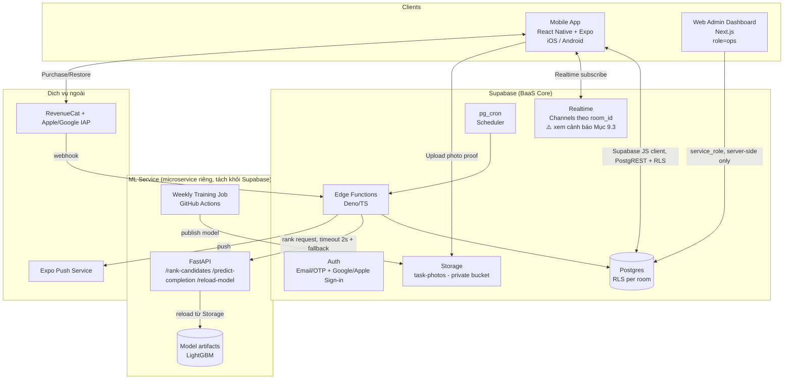
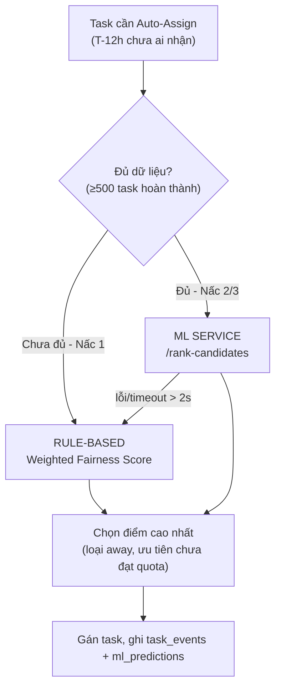
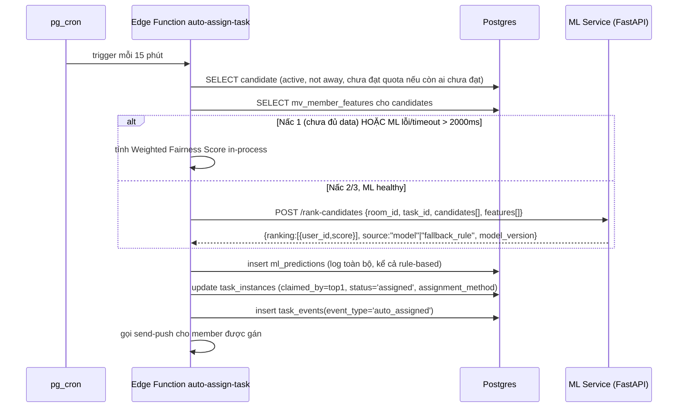
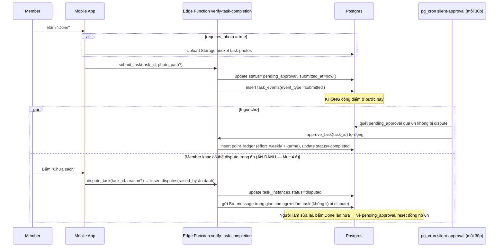
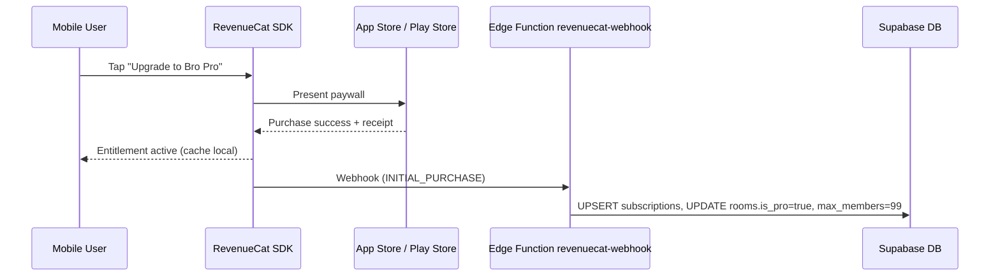
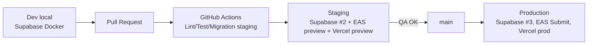

# DUE BRO — SOLUTION ARCHITECTURE DOCUMENT (BẢN GỘP FINAL v1.1)
### "Bro, it's due." — Tài liệu kiến trúc kỹ thuật cho Dev Agent

> **Nguồn gộp:** Bản Sonnet 5 (`Kien_Truc_He_Thong_Due_Bro.md`) làm khung chính (chi tiết luồng nghiệp vụ, schema, API contract đầy đủ nhất) + các điểm được Opus 5 xác nhận là tốt hơn từ bản của chính nó (`DueBro_Solution_Architecture.md`), sau khi hai model tự so sánh chéo. Có 1 điểm mở đã được chủ dự án quyết định (xem Mục 6.6).
>
> **Đối tượng đọc:** Dev Agent / Engineering Team — tài liệu này viết để đọc là code được luôn, không cần hỏi lại trừ khi gặp mục có đánh dấu ❓.

| Thông tin | Chi tiết |
|---|---|
| Team size | 1-2 dev |
| Timeline MVP | 2-3 tháng |
| Mobile stack | React Native + Expo (EAS Build/Dev Client) |
| Backend | Supabase (Postgres + Auth + Realtime + Storage + Edge Functions) |
| AI | ML model tự train, theo lộ trình 2 giai đoạn (rule-based → ML) |
| Client scope | Mobile (iOS/Android) + Web Admin Dashboard (nội bộ vận hành) |
| Monetization | RevenueCat + IAP (Apple/Google) |

---

## 0. QUYẾT ĐỊNH KIẾN TRÚC GỐC (ADR)

| # | Hạng mục | Lựa chọn | Lý do |
|---|---|---|---|
| ADR-1 | Mobile framework | **React Native + Expo**, dùng **EAS Dev Client ngay từ Sprint 0** (không dùng Expo Go) | RevenueCat SDK là native module, không chạy được trên Expo Go — nếu để tới cuối kỳ mới build native sẽ vỡ trận, phải dựng Dev Client sớm để test được mọi tính năng xuyên suốt |
| ADR-2 | Backend | **Supabase** (Postgres + Auth + Realtime + Storage + Edge Functions) | Giảm workload backend cho 1-2 dev, có RLS sẵn cho room-isolation |
| ADR-3 | AI phân bổ/xếp hạng việc | **ML model tự train**, triển khai theo **2 giai đoạn**: rule-based trước (MVP) → ML ranking sau khi đủ dữ liệu | Tránh song song 2 rủi ro lớn (app + ML pipeline) cho team nhỏ; contract API giữ nguyên nên chuyển đổi không tốn công sửa kiến trúc |
| ADR-4 | Client scope | Mobile (RN) + **Web Admin Dashboard** (Next.js) | Dashboard phục vụ đội vận hành, không phải Room Host |
| ADR-5 | Admin Dashboard đối tượng & auth | Đội vận hành nội bộ, phân quyền qua **custom claim `app_metadata.role = 'ops'`** (không dùng bảng whitelist riêng) | Gọn hơn, đúng kiểu Supabase-native, dễ set qua Supabase Dashboard/Edge Function admin-invite |
| ADR-6 | Monetization | **RevenueCat + IAP** (Apple/Google) | **Bắt buộc theo App Store Review Guideline 3.1.1** (Apple yêu cầu mọi nội dung/tính năng số tiêu thụ trong app phải qua In-App Purchase, không được dùng cổng thanh toán ngoài) — không phải chỉ là lựa chọn tiện lợi, mà là ràng buộc chính sách store; RevenueCat giảm effort xử lý receipt validation + entitlement cross-platform |
| ADR-7 | Payment phụ (Phase 2) | Stripe — dự phòng cho Affiliate Commerce/B2B | Không cần cho MVP |

---

## 1. KIẾN TRÚC TỔNG QUAN



**Nguyên tắc chủ đạo:** Đọc dữ liệu đơn giản (list task, list room…) đi thẳng qua Supabase client (PostgREST + RLS) — **không viết Edge Function riêng**. Chỉ viết Edge Function/RPC khi: (a) có tác dụng phụ nhạy cảm (tính điểm, gán việc), (b) cần `service_role` để bypass RLS có kiểm soát, (c) tích hợp bên thứ ba (webhook).

---

## 2. TECH STACK

| Layer | Công nghệ | Ghi chú |
|---|---|---|
| Mobile | React Native + Expo (SDK mới nhất), TypeScript, Expo Router | EAS Dev Client từ Sprint 0 (ADR-1) |
| UI | NativeWind (Tailwind cho RN) | Dùng chung design tokens với Admin Web |
| State/data | TanStack Query + Supabase JS client | Cache + realtime invalidation |
| Push | expo-notifications + Expo Push Service | Không tích hợp FCM/APNs thô |
| Backend | Supabase: Postgres, Auth, Realtime, Storage, Edge Functions (Deno/TS), pg_cron | |
| ML Service | Python, FastAPI, LightGBM, scikit-learn | Container riêng (Railway/Render/Fly.io), tách khỏi Supabase |
| Admin Web | Next.js (App Router), Tailwind, Server Components/Route Handlers | Deploy Vercel |
| Monetization | RevenueCat SDK (`react-native-purchases`) + Apple/Google IAP | Native module → cần EAS Build |
| Monitoring | Sentry (runtime error), PostHog (funnel/retention), Supabase Dashboard | |
| CI/CD | GitHub Actions, EAS Build/Submit/Update, Vercel auto-deploy | |

---

## 3. CẤU TRÚC MONOREPO

```
duebro/
├── apps/
│   ├── mobile/              # Expo app
│   └── admin/                # Next.js admin dashboard
├── services/
│   └── ml-service/           # FastAPI + LightGBM
│       ├── api/
│       ├── training/train_ranker.py
│       └── models/
├── supabase/
│   ├── migrations/
│   └── functions/            # Edge Functions (Deno)
├── packages/
│   ├── design-tokens/        # màu, font dùng chung mobile + admin
│   └── shared-types/         # types + bro-voice.json templates
└── .github/workflows/        # CI/CD, weekly retrain job
```

---

## 4. MÔ HÌNH DỮ LIỆU (SUPABASE POSTGRES)

> Toàn bộ bảng bật RLS. Quy tắc chung: user chỉ thấy dữ liệu của `room_id` mà họ là thành viên (`room_members`), trừ trường hợp đặc biệt ghi chú riêng (Anonymity Shield).

### 4.1 Enums

```sql
create type member_role as enum ('host', 'member');
create type task_source as enum ('recurring', 'adhoc', 'life_deadline');
create type task_status as enum (
  'open', 'claimed', 'assigned', 'pending_approval',
  'disputed', 'completed', 'expired'
);
create type escalation_level as enum ('friendly', 'due', 'sarcastic', 'sos');
create type point_type as enum ('effort_weekly', 'karma_permanent');
create type point_reason as enum (
  'task_base', 'volunteer_bonus', 'sos_rescue_bonus', 'swap_karma_bonus',
  'weekly_reset', 'manual_adjustment', 'penalty'
);
create type away_status as enum ('active', 'away');
```

### 4.2 Người dùng & phòng

```sql
create table profiles (
  id uuid primary key references auth.users(id) on delete cascade,
  display_name text not null,
  avatar_url text,
  push_token text,
  locale text default 'vi',
  created_at timestamptz not null default now()
);

create table rooms (
  id uuid primary key default gen_random_uuid(),
  name text not null,
  invite_code text unique not null,
  mascot_name text default 'Bro',
  is_pro boolean not null default false,
  max_members int not null default 4,
  reward_contract_text text,
  created_by uuid not null references profiles(id),
  created_at timestamptz not null default now()
);

create table room_members (
  room_id uuid not null references rooms(id) on delete cascade,
  member_id uuid not null references profiles(id) on delete cascade,
  role member_role not null default 'member',
  away_status away_status not null default 'active',
  away_from date,
  away_to date,
  joined_at timestamptz not null default now(),
  is_new_member_until timestamptz,
  karma_score numeric not null default 0,
  left_at timestamptz,  -- soft-delete, giữ lịch sử đóng góp
  primary key (room_id, member_id)
);
create index idx_room_members_room on room_members(room_id) where left_at is null;
```

### 4.3 Công việc (Chores / Tasks)

```sql
create table chore_templates (
  id uuid primary key default gen_random_uuid(),
  room_id uuid not null references rooms(id) on delete cascade,
  name text not null,
  category text not null,
  default_effort_points int not null,
  estimated_minutes int,
  recurrence_rule text,               -- iCal RRULE
  requires_photo boolean not null default false,  -- true nếu effort_points >= 30 (BRD 3.2)
  is_active boolean not null default true,
  created_by uuid not null references profiles(id),
  approved_by_host boolean not null default true,
  created_at timestamptz not null default now()
);

create table task_instances (
  id uuid primary key default gen_random_uuid(),
  room_id uuid not null references rooms(id) on delete cascade,
  template_id uuid references chore_templates(id),
  source task_source not null,
  title text not null,
  category text,
  effort_points int not null,
  requires_photo boolean not null default false,
  status task_status not null default 'open',
  due_at timestamptz not null,
  opened_at timestamptz not null default now(),
  claimed_by uuid references profiles(id),
  claimed_at timestamptz,
  assignment_method text,             -- 'volunteer' | 'auto_round_robin' | 'auto_ml' | 'sos_swap'
  submitted_at timestamptz,
  approved_at timestamptz,
  last_escalation_level escalation_level,
  bonus_multiplier numeric not null default 1.0,
  original_owner_id uuid references profiles(id),  -- swap: chủ gốc
  created_by uuid references profiles(id),
  created_at timestamptz not null default now()
  -- LƯU Ý: KHÔNG có cột disputed_by / dispute_reason ở đây (khác bản nháp trước) —
  -- lý do ẩn danh, xem bảng `disputes` riêng ở Mục 4.6.
);
create index idx_task_room_status on task_instances(room_id, status);
create index idx_task_due on task_instances(due_at) where status in ('open','claimed','assigned');

-- Event log append-only — audit + dữ liệu train ML
create table task_events (
  id bigint generated always as identity primary key,
  task_id uuid not null references task_instances(id) on delete cascade,
  event_type text not null,  -- 'created','claimed','auto_assigned','escalation_sent','submitted','approved','disputed','completed','expired','swapped'
  actor_id uuid references profiles(id),
  metadata jsonb,
  created_at timestamptz not null default now()
);

create table task_photos (
  id uuid primary key default gen_random_uuid(),
  task_id uuid not null references task_instances(id) on delete cascade,
  storage_path text not null,
  uploaded_by uuid not null references profiles(id),
  created_at timestamptz not null default now()
);
```

### 4.4 Sổ điểm — Dual-Currency, append-only duy nhất

> **Quyết định thiết kế quan trọng:** dùng **một bảng ledger append-only duy nhất** cho cả `effort_weekly` (tuần, tự "reset" bằng cách group theo `week_start`) và `karma_permanent` (vĩnh viễn). Không dùng cột "current_score" bị `UPDATE` cộng dồn — tránh race condition khi 2 task hoàn thành cùng lúc, và không cần 2 cơ chế ghi điểm khác nhau phải giữ đồng bộ.

```sql
create table point_ledger (
  id bigint generated always as identity primary key,
  room_id uuid not null references rooms(id),
  member_id uuid not null references profiles(id),
  point_type point_type not null,
  reason point_reason not null,
  amount numeric not null,           -- có thể âm (penalty, redemption)
  task_id uuid references task_instances(id),
  week_start date,                   -- chỉ set cho effort_weekly
  created_at timestamptz not null default now()
);
create index idx_ledger_room_member_week on point_ledger(room_id, member_id, week_start) where point_type = 'effort_weekly';

create view weekly_quota_progress as
select room_id, member_id, week_start, sum(amount) as achieved_points
from point_ledger
where point_type = 'effort_weekly'
group by room_id, member_id, week_start;

create table weekly_quota_targets (
  room_id uuid not null references rooms(id),
  member_id uuid not null references profiles(id),
  week_start date not null,
  target_points int not null,   -- mặc định 60, giảm 50% nếu is_new_member_until còn hiệu lực
  primary key (room_id, member_id, week_start)
);

create table karma_redemptions (
  id uuid primary key default gen_random_uuid(),
  member_id uuid not null references profiles(id),
  reward_type text not null,     -- 'skip_next_task', ...
  karma_cost numeric not null,
  redeemed_at timestamptz not null default now(),
  used_at timestamptz
);
```

**Ràng buộc bắt buộc khi code:** `insert into point_ledger` **chỉ được thực hiện ở một nơi duy nhất** — hàm `approve_task` (RPC `SECURITY DEFINER`, service role). Không client nào được insert trực tiếp. `approve_task` phải là 1 transaction atomic (update `task_instances.status`, insert `point_ledger`, insert `task_events` cùng lúc) và phải kiểm tra `not exists (select 1 from point_ledger where task_id = :id)` để đảm bảo 1 task chỉ được approve đúng 1 lần.

### 4.5 Hạn chót sinh hoạt (Bills)

```sql
create table bill_templates (
  id uuid primary key default gen_random_uuid(),
  room_id uuid not null references rooms(id) on delete cascade,
  name text not null,
  recurrence_rule text not null,
  created_by uuid not null references profiles(id),
  is_active boolean not null default true
);
-- Bill instance tái dùng task_instances với source='life_deadline' — không tách bảng riêng
-- để không phải maintain 2 luồng escalation song song.
```

### 4.6 Anonymity Shield — Nhắc nhẹ & Dispute (đều ẩn danh)

> **Quyết định đã chốt với chủ dự án:** BRD chỉ nói rõ ẩn danh cho nút "Bro ơi, nhắc nhẹ cái". Nút **"Chưa sạch" (dispute) cũng áp dụng cơ chế ẩn danh tương tự** — người bị dispute (và các member thường khác) **không** thấy ai là người dispute. **Admin (role=ops)** vẫn thấy được đầy đủ để xử lý report nghiêm trọng/lạm dụng tính năng.

```sql
create table notifications_log (
  id bigint generated always as identity primary key,
  room_id uuid not null references rooms(id),
  recipient_id uuid not null references profiles(id),
  task_id uuid references task_instances(id),
  level escalation_level,
  message text not null,
  sent_at timestamptz not null default now()
);

-- Nhắc nhẹ ẩn danh — bảng gốc KHÔNG bao giờ SELECT được bởi client,
-- chỉ Edge Function (service role) đọc requester_id.
create table nudge_requests (
  id bigint generated always as identity primary key,
  room_id uuid not null references rooms(id),
  task_id uuid not null references task_instances(id),
  requester_id uuid not null references profiles(id),  -- ẩn danh với member khác
  created_at timestamptz not null default now()
);

-- Dispute — CÙNG cơ chế ẩn danh như nudge (quyết định Mục 4.6)
create table disputes (
  id uuid primary key default gen_random_uuid(),
  task_id uuid not null references task_instances(id) on delete cascade,
  room_id uuid not null references rooms(id),
  raised_by uuid not null references profiles(id),  -- ẩn danh với member thường, chỉ admin/service_role đọc được
  reason text,
  status text not null default 'open',   -- 'open' | 'resolved'
  created_at timestamptz not null default now(),
  resolved_at timestamptz
);

-- View public cho mobile client — KHÔNG có raised_by
create view disputes_public as
  select id, task_id, room_id, status, created_at, resolved_at from disputes;
```

### 4.7 Swap / SOS

```sql
create table swap_requests (
  id uuid primary key default gen_random_uuid(),
  task_id uuid not null references task_instances(id),
  requested_by uuid not null references profiles(id),
  accepted_by uuid references profiles(id),
  status text not null default 'open',  -- open | accepted | cancelled
  created_at timestamptz not null default now(),
  accepted_at timestamptz
);
```

### 4.8 Row Level Security — mẫu chuẩn

```sql
create or replace function is_room_member(target_room_id uuid)
returns boolean language sql security definer as $$
  select exists (
    select 1 from room_members
    where room_id = target_room_id and member_id = auth.uid() and left_at is null
  );
$$;

alter table task_instances enable row level security;
create policy "room_members_can_select_tasks" on task_instances for select
using (is_room_member(room_id));
create policy "room_members_can_claim_or_submit" on task_instances for update
using (is_room_member(room_id)) with check (is_room_member(room_id));

-- point_ledger: chỉ SELECT cho member phòng mình, KHÔNG có policy INSERT/UPDATE cho 'authenticated'
alter table point_ledger enable row level security;
create policy "select_own_room_ledger" on point_ledger for select
using (is_room_member(room_id));

-- nudge_requests: member được INSERT, KHÔNG được SELECT bảng gốc
alter table nudge_requests enable row level security;
create policy "insert_own_nudge" on nudge_requests for insert
with check (requester_id = auth.uid() and is_room_member(room_id));
create view nudge_counts as
select task_id, room_id, count(*) as nudge_count from nudge_requests group by task_id, room_id;
grant select on nudge_counts to authenticated;

-- disputes: giống nudge_requests — member INSERT được, KHÔNG SELECT bảng gốc, chỉ SELECT qua disputes_public
alter table disputes enable row level security;
create policy "insert_own_dispute" on disputes for insert
with check (raised_by = auth.uid() and is_room_member(room_id));
grant select on disputes_public to authenticated;
-- KHÔNG tạo policy SELECT nào cho 'authenticated' trên bảng disputes gốc.

-- Admin (role=ops) đọc đầy đủ disputes qua service_role ở server-side (Mục 7), KHÔNG qua RLS 'authenticated'.
```

> Áp dụng đúng pattern `is_room_member(room_id)` cho toàn bộ bảng còn lại theo room: `chore_templates`, `room_members`, `task_photos`, `swap_requests`, `notifications_log`, `weekly_quota_targets`.

### 4.9 Feature phục vụ ML — Materialized View (thay vì bảng + cron riêng)

> **Quyết định:** dùng **Materialized View** thay vì một bảng `ml_member_features` cập nhật bởi Edge Function riêng — đơn giản hơn, ít code hơn, phù hợp team 1-2 dev. Chỉ cần 1 lệnh `REFRESH` theo lịch.

```sql
create materialized view mv_member_features as
select
  rm.member_id, rm.room_id,
  coalesce(wqp.achieved_points, 0)::float / nullif(wqt.target_points, 0) as quota_progress_pct,
  avg(case when te.event_type = 'completed' then 1 else 0 end) as completion_rate,
  avg(extract(epoch from (ti.approved_at - ti.due_at)) / 3600)
    filter (where ti.approved_at > ti.due_at) as avg_delay_hours,
  (select sum(amount) from point_ledger pl
     where pl.member_id = rm.member_id and pl.point_type = 'karma_permanent') as total_karma,
  rm.away_status,
  rm.is_new_member_until,
  extract(day from now() - rm.joined_at) as tenure_days
from room_members rm
left join weekly_quota_progress wqp on wqp.room_id = rm.room_id and wqp.member_id = rm.member_id
left join weekly_quota_targets wqt on wqt.room_id = rm.room_id and wqt.member_id = rm.member_id and wqt.week_start = wqp.week_start
left join task_instances ti on ti.claimed_by = rm.member_id
left join task_events te on te.task_id = ti.id
where rm.left_at is null
group by rm.member_id, rm.room_id, wqp.achieved_points, wqt.target_points, rm.away_status, rm.is_new_member_until, rm.joined_at;

create unique index on mv_member_features (room_id, member_id);
-- Refresh mỗi giờ qua pg_cron: select cron.schedule('refresh-mv-features', '0 * * * *',
--   $$ refresh materialized view concurrently mv_member_features $$);

-- Log mọi lần ML/rule-based đưa ra ranking, dùng để đánh giá & audit
create table ml_predictions (
  id bigint generated always as identity primary key,
  task_id uuid not null references task_instances(id),
  candidate_member_id uuid not null references profiles(id),
  score numeric not null,
  rank int not null,
  model_version text not null,   -- 'rule_v1' hoặc 'lgbm_YYYYMMDD'
  created_at timestamptz not null default now()
);
```

---

## 5. KIẾN TRÚC AI/ML — PHÂN BỔ & XẾP HẠNG CÔNG VIỆC

### 5.1 Định nghĩa bài toán

Theo BRD, thuật toán phân bổ có 3 bước: **(1) Bounty Board tự nguyện → (2) Weekly Quota → (3) Auto-Assign fallback**. ML **chỉ can thiệp vào bước (3)** — khi không ai chủ động nhận việc sau `T-12h`. Bài toán: cho một task cần auto-assign, **xếp hạng** các thành viên đủ điều kiện (không away, chưa đạt quota) theo khả năng hoàn thành đúng hạn và công bằng khối lượng — chọn người xếp hạng cao nhất.

### 5.2 Lộ trình 3 nấc thang (dung hòa giữa 2 hướng tiếp cận)

| Nấc | Khi nào | Phương pháp | Vì sao |
|---|---|---|---|
| **Nấc 1 — Rule-based** | MVP launch, Sprint 3, không có dữ liệu | Weighted Fairness Score, công thức tường minh chạy trong Edge Function TypeScript | 100% deterministic, giải thích được ngay, không cần train gì |
| **Nấc 2 — Pointwise Classifier** | Sau MVP, khi có ≥ 500 task hoàn thành toàn hệ thống (~tháng 3+) | LightGBM **binary classifier** dự đoán `P(on_time_completion \| member, task, context)`, kết hợp fairness weight ở tầng serving | Với data MVP nhỏ, mô hình pairwise/pointwise ranking thuần (LambdaMART) dễ **overfit** vì thiếu counterfactual candidates thật (ta không biết nếu gán cho người khác thì kết quả ra sao) — pointwise classifier ổn định hơn ở giai đoạn dữ liệu còn mỏng |
| **Nấc 3 — Learning-to-Rank (LambdaMART)** | Khi đã tích lũy đủ lịch sử ranking thật (có `ml_predictions` + outcome đối chứng qua nhiều tháng vận hành Nấc 2, khuyến nghị ≥ 6 tháng dữ liệu) | LightGBM LambdaMART (pairwise ranking) | Lúc này đã có đủ cặp so sánh thật giữa các ứng viên để tối ưu trực tiếp thứ tự ranking, không chỉ xác suất hoàn thành đơn lẻ |

> Đây là điểm quan trọng nhất agent cần hiểu: **không nhảy thẳng vào LambdaMART khi chưa đủ data** — đi tuần tự Nấc 1 → 2 → 3, mỗi nấc chỉ đổi implementation phía sau API, không đổi contract.



**Công thức Nấc 1 (rule-based):**
```
score(member, task) =
    w1 * (1 - current_quota_ratio)        -- ai còn xa target tuần → ưu tiên
  + w2 * category_reliability_manual       -- tỉ lệ hoàn thành đúng hạn theo category, tính từ point_ledger
  + w3 * recency_penalty                   -- vừa được gán gần đây → giảm điểm
  - w4 * is_new_member_bonus_exclusion     -- tân binh giảm ưu tiên bị gán việc nặng (>=30đ) tuần đầu
-- w1=0.4, w2=0.3, w3=0.2, w4=0.1 (config được, lưu bảng room_settings, host chỉnh ở Phase 2)
```

**Công thức Nấc 2/3 (serving-time, giữ nguyên khi chuyển 2→3):**
```
final_score(member, task) = P_ml(on_time | member, task) * (1 - current_quota_ratio)^gamma
```
Nhân với `(1 - quota_ratio)` để model không "bóc lột" người đáng tin cậy nhất — công bằng vẫn được bảo toàn dù ML dự đoán họ hoàn thành tốt.

**Vì sao LightGBM, không Deep Learning:** dữ liệu dạng bảng, quy mô nhỏ-vừa (hàng nghìn–chục nghìn dòng/năm đầu), cần giải thích được (feature importance) để debug khi user thắc mắc "sao Bro gán việc cho tui hoài". Deep learning không có lợi thế ở quy mô này.

**Label:** `completed_on_time` (boolean) từ `task_events`, chỉ lấy các task từng **auto-assign** (không lấy task volunteer — hành vi khác, thiên lệch tích cực, đưa vào sẽ méo model). Lọc bỏ task có `status` từng là `disputed` khỏi tập train.

**Threshold "500 task"** là ngưỡng **toàn hệ thống** (không phải riêng từng phòng, vì từng phòng lẻ sẽ không bao giờ đủ). Model train chung, `room_id` chỉ là 1 feature ngữ cảnh — con số này nên được xác nhận lại khi có dữ liệu thật, không phải hằng số cứng.

### 5.3 Feature Engineering

Lấy từ `mv_member_features` (Mục 4.9): `quota_progress_pct`, `completion_rate`, `avg_delay_hours`, `total_karma`, `away_status`, `tenure_days`, `is_new_member`, cộng thêm đặc điểm task hiện tại (`effort_points`, `category`, `requires_photo`), ngữ cảnh thời gian (`time_of_day_bucket`, `day_of_week`), và `room_size`.

### 5.4 Kiến trúc phục vụ (Serving)



### 5.5 API Contract của ML Service

```
POST /rank-candidates
{ "room_id": "...", "task_id": "...", "candidates": ["uid1","uid2",...] }
→ { "ranking": [{"user_id":"uid1","score":0.82}, ...], "source": "model" | "fallback_rule", "model_version": "..." }

POST /predict-completion
{ "user_id": "...", "task_id": "..." }
→ { "on_time_probability": 0.63 }

POST /reload-model
{ "model_path": "ml-models/model_20260915.txt" }
→ { "ok": true, "model_version": "lgbm_20260915" }
```
`/reload-model` cho phép **hot-swap model artifact mới mà không cần redeploy container** — training job gọi endpoint này sau khi publish model thành công lên Storage.

### 5.6 Training & Retraining

- **Pipeline** (`training/train_ranker.py`) chạy **ngoài request path**, trigger bởi **GitHub Actions scheduled workflow hàng tuần** (Chủ nhật đêm).
- Đọc `task_events` + `mv_member_features` snapshot qua `service_role` key (GitHub Secrets) → split theo thời gian (80% cũ để train, 20% mới nhất để validate — **không random split**, tránh leak tương lai) → train → đánh giá AUC (Nấc 2) hoặc NDCG (Nấc 3) + **offline replay** (so sánh nếu dùng model này rank thay vì baseline đã xảy ra thực tế, on-time completion top-1 có cải thiện ≥3% không).
- Nếu cải thiện: publish artifact mới lên Storage bucket `ml-models` → gọi `/reload-model`. Nếu không: giữ model cũ, log lại để dev xem xét.
- **A/B test** (khuyến nghị Phase 2): 50% phòng dùng ML, 50% rule-based, so sánh On-time Completion Rate trước khi rollout 100%.

### 5.7 Lưu ý bắt buộc khi code phần này

- ML service **không bao giờ** là single point of failure — mọi lời gọi có timeout 2s + fallback rule-based độc lập (code rule-based không phụ thuộc ML service chạy được).
- **Sprint 1-6 (MVP)**: `auto-assign-task` gọi thẳng rule-engine, chưa cần ML service chạy thật — nhưng **thiết kế API `/rank-candidates` ngay từ đầu** để sau này chỉ đổi implementation phía sau, giữ nguyên contract.
- Cờ bật/tắt `USE_ML_RANKER` ở Edge Function — chuyển Nấc không đổi kiến trúc, chỉ đổi giá trị cờ.

---

## 6. ĐẶC TẢ CHI TIẾT TỪNG LUỒNG NGHIỆP VỤ

### 6.1 Luồng tạo lịch công việc định kỳ

**Trigger:** `pg_cron` → Edge Function `generate-recurring-tasks` mỗi ngày 00:05.
1. Quét `chore_templates` có `is_active=true` và `approved_by_host=true`.
2. Parse `recurrence_rule` (RRULE, thư viện `rrule` Deno-compatible), tính instance cần sinh hôm nay.
3. `insert into task_instances(status='open', opened_at=now(), due_at=..., effort_points=..., requires_photo=..., source='recurring')`.
4. Ghi `task_events(event_type='created')`.
5. Nếu `due_at` cách hiện tại < 24h, có thể sinh sớm 1 ngày (tuỳ cấu hình template) để đáp ứng "đưa lên bảng chung trước 24h" (BRD).

### 6.2 Luồng Bounty Board — nhận việc tự nguyện

Client subscribe Realtime channel `room:{room_id}:tasks`, hiển thị task `status='open'` sort theo `due_at`.

```sql
create or replace function claim_task(p_task_id uuid)
returns task_instances
language plpgsql security definer as $$
declare v_task task_instances;
begin
  update task_instances
  set status = 'claimed', claimed_by = auth.uid(), claimed_at = now(),
      assignment_method = 'volunteer', bonus_multiplier = 1.1
  where id = p_task_id and status = 'open'   -- chống race condition khi 2 người bấm cùng lúc
  returning * into v_task;

  if v_task.id is null then
    raise exception 'Task đã được người khác nhận hoặc không còn ở trạng thái mở';
  end if;

  insert into task_events(task_id, event_type, actor_id) values (p_task_id, 'claimed', auth.uid());
  return v_task;
end;
$$;
```
Realtime tự đẩy update tới toàn phòng → task biến mất khỏi Bounty Board ngay (tránh 2 người cùng nhận).

### 6.3 Luồng Auto-Assign

Xem Mục 5.4. Filter candidate trước khi rank:
```sql
select rm.member_id from room_members rm
where rm.room_id = :room_id and rm.left_at is null and rm.away_status = 'active'
  and not exists (
    select 1 from weekly_quota_progress wqp
    join weekly_quota_targets wqt using (room_id, member_id, week_start)
    where wqp.room_id = rm.room_id and wqp.member_id = rm.member_id
      and wqp.achieved_points >= wqt.target_points
  )
-- Nếu rỗng (ai cũng đạt quota) → bỏ điều kiện quota, chỉ giữ away_status='active', xoay vòng thuần túy.
```

### 6.4 Luồng nhắc nhở đa cấp độ (Bro Voice Escalation Engine)

**Trigger:** `pg_cron` → `escalate-reminders` mỗi 5 phút. Idempotent qua cột `last_escalation_level`.

| Mốc | Điều kiện | Level |
|---|---|---|
| Trước hạn 2h | `0 < due_at - now() <= 120 phút` | `friendly` |
| Đúng hạn | `-5 <= phút đến hạn <= 0` | `due` |
| Trễ 2-6h | `-360 <= phút đến hạn < -120` | `sarcastic` |
| Trễ >12h | `phút đến hạn < -720` | `sos` (broadcast lại Bounty Board, x1.5 điểm nếu ai giải cứu) |

Câu thoại lưu trong bảng `bro_message_templates(level, message, weight)` — không hardcode trong code, dễ mở rộng giọng "Cà khịa/Tổng tài/Anime/Miền Tây" cho gói Pro sau này mà không cần deploy lại. Gửi qua Expo Push API, log `delivered` theo receipt callback (đáp ứng NFR ≥99.5%, lệch ≤60s — xem lưu ý ❓ Mục 10).

### 6.5 Luồng xác thực hoàn thành & chống gian lận



**Ràng buộc bắt buộc:** `insert point_ledger` chỉ trong `approve_task` (transaction atomic, `SECURITY DEFINER`, 1 lần duy nhất/task) — xem Mục 4.4.

### 6.6 Luồng nhắc nhẹ & Dispute ẩn danh (Anonymity Shield)

1. Member A bấm "Bro ơi, nhắc nhẹ cái" trên task của B → RPC `request_nudge(task_id)` → insert `nudge_requests` (chỉ A insert được, không ai SELECT bảng gốc).
2. Member A (hoặc bất kỳ ai) bấm "Chưa sạch" khi verify → Edge Function `dispute_task(task_id, reason?)` → insert `disputes` (service role), **cùng cơ chế ẩn danh như nudge** (quyết định Mục 4.6).
3. Cả hai trường hợp: Edge Function gửi push tới người phụ trách task với message trung gian từ Bro — **không kèm thông tin người gửi/dispute**; người nhận không phân biệt được đây là do hệ thống tự động hay do bị "report".
4. Client hiển thị "đã có N người nhắc" qua view `nudge_counts`, và trạng thái dispute qua `disputes_public` — cả hai đều không lộ danh tính.
5. **Admin (role=ops)** đọc đầy đủ `disputes.raised_by` qua `service_role` server-side để xử lý report nghiêm trọng/lạm dụng tính năng — khác quyền với mobile client.

### 6.7 Luồng tính điểm & chu kỳ

- **Reset hàng tuần:** `pg_cron reset-weekly-quota` mỗi Thứ Hai 00:00 chỉ cần tạo record mới trong `weekly_quota_targets` cho tuần mới — **không cần "xóa" điểm cũ** vì điểm tuần tính bằng `sum(amount) group by week_start` (view `weekly_quota_progress`), tuần mới tự bắt đầu từ 0.
- **Karma tích lũy:** mỗi `approve_task`, ngoài `effort_weekly` insert thêm 1 dòng `karma_permanent` (vd 20% effort_points) — không bao giờ reset.
- **"Tuần này Bro uy tín":** query đơn giản cuối tuần, không cần bảng riêng.
- **Thẻ Miễn Làm Việc Nhà:** đổi Karma → insert `karma_redemptions`, trừ karma ngay bằng `insert point_ledger` amount âm, `reason='manual_adjustment'`. ❓ (xem Mục 10, câu hỏi mở #4).

### 6.8 Luồng Away Mode

1. Member set `away_status='away'`, `away_from/away_to` (RLS cho phép tự sửa row mình).
2. Auto-assign tự loại người `away_status != 'active'` — không cần logic riêng.
3. `pg_cron` mỗi ngày: `away_to < today` → tự set lại `away_status='active'`.
4. Không giảm quota target của người away — khối lượng dồn tự nhiên cho người active vì thuật toán chỉ chọn trong nhóm active.

### 6.9 Luồng SOS Swap

1. Member bấm "Bro ơi, cứu bồ!" → insert `swap_requests(status='open')`; task đó không tính "trễ hạn" với `original_owner_id`.
2. Task broadcast lên Bounty Board (dùng lại `claim_task`, gắn cờ `is_swap=true` cho UI).
3. Khi có người nhận: update `swap_requests.status='accepted', accepted_by`.
4. Khi `approve_task`: người **nhận hộ** được 100% effort_points + bonus karma (`reason='swap_karma_bonus'`); người **nhờ** không bị trừ điểm và bị loại khỏi tập tính `completion_rate` khi tính feature ML (loại task có `original_owner_id is not null`).

### 6.10 Luồng Onboarding / Offboarding

**Tham gia:** RPC `join_room(invite_code)`: kiểm tra `max_members` chưa vượt → insert `room_members(is_new_member_until = now() + interval '7 days')` → insert `weekly_quota_targets` tuần hiện tại với `target_points = 30` (50% của 60, chính sách "Tân binh").

**Rời phòng:** RPC `leave_room(room_id, new_host_id?)`: nếu là host, bắt buộc chỉ định host mới hợp lệ trước; `room_members.left_at = now()` (**không xóa row**, giữ lịch sử điểm/đóng góp — BRD 5.3); task đang `assigned`/`claimed` bởi người rời mà chưa `completed` → tự chuyển `status='open'` (trigger `AFTER UPDATE` khi `left_at` được set).

---

## 7. WEB ADMIN DASHBOARD

- **Đối tượng:** đội vận hành nội bộ (không phải Room Host/Member).
- **Auth:** Supabase Auth, phân quyền qua **custom claim `app_metadata.role = 'ops'`** (set qua Supabase Dashboard hoặc Edge Function admin-invite riêng) — **không dùng bảng whitelist**.
- **Data access:** `service_role` phía server (Next.js Server Components/Route Handlers) — **không** áp RLS room-based, vì admin cần xem **aggregate cross-room**. `service_role` key **không bao giờ** lộ ra bundle client.
- **Nội dung chính:**
  - North Star Metrics: Task Completion Rate, On-time Completion Rate, Room 30-Day Retention, Viral K-factor.
  - Room health list: phòng nguy cơ churn (completion rate thấp, không hoạt động >7 ngày).
  - ML monitoring: tỉ lệ `ml_predictions.model_version='rule_v1'` (fallback) vs model thật theo thời gian — biết khi nào model đủ tin cậy để chuyển Nấc.
  - **Dispute/report queue:** đọc trực tiếp bảng `disputes` đầy đủ (kể cả `raised_by`) — admin **được phép** thấy để xử lý report nghiêm trọng, khác hẳn quyền client mobile (chỉ thấy `disputes_public`).
  - Subscription overview (từ bảng `subscriptions`).

---

## 8. API / EDGE FUNCTION CONTRACT

| Function | Loại | Input | Output | Ghi chú |
|---|---|---|---|---|
| `claim_task` | Postgres RPC | `task_id` | `task_instances` row | Mục 6.2, chống race condition |
| `submit_task` | Edge Function | `task_id, photo_path?` | `{status:'pending_approval'}` | Mục 6.5 |
| `dispute_task` | Edge Function | `task_id, reason?` | `{status:'disputed'}` | Ẩn danh, Mục 6.6 |
| `approve_task` (internal) | Postgres RPC `SECURITY DEFINER` | `task_id` | — | Chỉ gọi bởi cron, không expose client |
| `request_nudge` | Postgres RPC | `task_id` | `{ok:true}` | Ẩn danh, Mục 6.6 |
| `join_room` / `leave_room` | Postgres RPC | `invite_code` / `room_id, new_host_id?` | row / `{ok:true}` | Mục 6.10 |
| `generate-recurring-tasks` | Edge Function (cron) | — | — | Mục 6.1, 00:05 hàng ngày |
| `escalate-reminders` | Edge Function (cron, mỗi 5p) | — | — | Mục 6.4 |
| `auto-assign-task` | Edge Function (cron, mỗi 15p) | — | — | Mục 5.4, 6.3 |
| `reset-weekly-quota` | Edge Function (cron, Thứ Hai 00:00) | — | — | Mục 6.7 |
| `refresh-mv-features` | pg_cron (mỗi giờ) | — | — | Refresh `mv_member_features` — Mục 4.9 |
| `revenuecat-webhook` | Edge Function (public, verify signature) | RevenueCat payload | `200 OK` | Update `subscriptions`, `rooms.is_pro/max_members` |
| `send-push` (internal) | Edge Function helper | `recipient_id, title, body, data` | — | Wrap Expo Push API |
| ML `/rank-candidates`, `/predict-completion`, `/reload-model` | FastAPI (microservice riêng) | Xem Mục 5.5 | Xem Mục 5.5 | Gọi từ `auto-assign-task` |

---

## 9. REALTIME, PUSH & BẢO MẬT

### 9.1 Realtime (trong app)
Channel `room:{room_id}:tasks` — `postgres_changes` trên `task_instances`, filter `room_id=eq.{room_id}`. Dùng cho Bounty Board live, trạng thái task live.

### 9.2 Push Notification
Expo Push Service làm lớp trung gian (không tích hợp FCM/APNs thô). Token cập nhật mỗi lần app mở, upsert `profiles.push_token`. Deep link: payload `{type:'task', task_id}` → mở thẳng `task/[id].tsx`.

### 9.3 ⚠️ Cảnh báo bảo mật Realtime — RẤT QUAN TRỌNG

**Supabase Realtime mặc định phát toàn bộ row thay đổi (full payload) qua `postgres_changes`, kể cả khi RLS `SELECT` đã chặn quyền truy vấn trực tiếp.** Điều này có nghĩa là nếu bật Realtime trực tiếp trên bảng `disputes` hoặc `nudge_requests` (hoặc trên `task_instances` nếu từng có cột `disputed_by`), cột nhạy cảm như `raised_by`/`requester_id` **có thể bị lộ qua Realtime payload dù RLS SELECT đã chặn** — đây là lỗ hổng dễ bị bỏ sót vì RLS "trông có vẻ" đã bảo vệ đủ.

**Biện pháp bắt buộc:**
- **Không bật Realtime replication** cho bảng gốc `disputes` và `nudge_requests`.
- Chỉ bật Realtime (nếu cần live update) trên các **view đã lọc cột nhạy cảm** (`disputes_public`, `nudge_counts`), hoặc đơn giản hơn: không dùng Realtime cho 2 bảng này, client tự poll lại khi cần (tần suất thấp, không cần live tuyệt đối cho tính năng này).
- Vì `task_instances` trong bản thiết kế này **không còn cột `disputed_by`** (đã tách sang bảng `disputes` riêng — Mục 4.3), rủi ro lộ qua Realtime trên `task_instances` đã được loại bỏ từ gốc.

### 9.4 Bảng tổng hợp bảo mật

| Yêu cầu | Giải pháp |
|---|---|
| Room isolation | RLS mọi bảng qua `is_room_member()` |
| Ẩn danh nhắc nhở & dispute | Không có RLS SELECT cho `authenticated` trên bảng gốc; chỉ view đã lọc cột; **không bật Realtime trên bảng gốc** (Mục 9.3) |
| Ảnh xác thực không public | Bucket `task-photos` private, signed URL có thời hạn (5-60 phút), path `{room_id}/{task_id}/{ts}.jpg` |
| Admin Web chỉ nội bộ | Custom claim `app_metadata.role='ops'`, `service_role` chỉ server-side |
| Chống tự chấm điểm | Silent Approval + Dispute; điểm chỉ ghi qua `approve_task` duy nhất |
| Webhook RevenueCat | Verify signature theo tài liệu RevenueCat trước khi xử lý |
| Secrets | `service_role` key, RevenueCat webhook secret, ML service key → GitHub Actions Secrets/env vars, không hardcode |

---

## 10. MONETIZATION & PAYMENT (RevenueCat + IAP)



- Sản phẩm: `pro_monthly`, `pro_yearly` — map subscription group App Store Connect/Play Console.
- **Bắt buộc theo App Store Review Guideline 3.1.1** (ADR-6) — không dùng cổng thanh toán ngoài cho nội dung/tính năng số tiêu thụ trong app.
- Feature gating: check `rooms.is_pro` (nguồn sự thật backend) + RevenueCat entitlement cache (UI phản hồi nhanh).
- Webhook verify signature RevenueCat, xử lý `INITIAL_PURCHASE`, `RENEWAL`, `CANCELLATION`, `EXPIRATION`.
- **RevenueCat SDK là native module → phải build bằng EAS Dev Client từ Sprint 0** (ADR-1), test TestFlight/Internal testing — **không test được qua Expo Go**.

---

## 11. NON-FUNCTIONAL REQUIREMENTS

| NFR (BRD Mục 7) | Giải pháp |
|---|---|
| Push ≥99.5%, lệch ≤60s | `pg_cron` 1-5 phút + Expo Push receipt tracking; xem câu hỏi mở #1 Mục 13 về giới hạn thực tế |
| ≤2 chạm hoàn tất việc | Nút "Done" = chạm 1; chụp ảnh (nếu cần) = chạm 2 |
| Tông màu Gen Z | `packages/design-tokens`: `#7C3AED / #181818 / #FAFAF9`, dùng chung NativeWind + Tailwind admin |
| Room isolation | RLS toàn hệ thống |

---

## 12. DEVOPS & DEPLOYMENT



| Thành phần | Hosting | CI/CD |
|---|---|---|
| Mobile | EAS Build + EAS Submit | GitHub Actions trigger khi merge `main`; OTA qua `expo-updates` cho thay đổi JS |
| Backend | Supabase (dev/staging/prod tách biệt) | `supabase migration new`, review PR, `supabase db push` tự động lên staging |
| ML Service | Railway/Render/Fly.io (container Python) | Build Docker → deploy; job retrain riêng theo lịch (Mục 5.6) |
| Web Admin | Vercel | Auto-deploy từ `apps/admin` khi merge `main` |

**Monitoring MVP:** Sentry (lỗi runtime), PostHog (funnel + retention), Supabase Dashboard (query performance, log Edge Function).

---

## 13. ROADMAP MVP — 2-3 THÁNG, 1-2 DEV

| Sprint | Thời gian | Nội dung |
|---|---|---|
| **Sprint 0** | Tuần 1 | Setup monorepo, Supabase project, **dựng EAS Dev Client ngay** (ADR-1 — không để tới cuối), CI/CD skeleton, design tokens, Auth (Phone OTP) |
| Sprint 1 | Tuần 2-3 | Room & Member Management, schema đầy đủ + RLS + migration |
| Sprint 2 | Tuần 4-5 | Smart Chores: template, Bounty Board, `claim_task`, recurring generation cron |
| Sprint 3 | Tuần 6-7 | Bro Voice Engine (escalation), Verification flow (submit/approve/dispute + Anonymity Shield) — **rule-based auto-assign (Nấc 1)**, chưa cần ML service |
| Sprint 4 | Tuần 8-9 | Point Economy (ledger, weekly reset, karma, leaderboard), Away Mode, SOS Swap |
| Sprint 5 | Tuần 10 | RevenueCat + Bro Pro paywall (đã có Dev Client từ Sprint 0 nên không bị dồn việc build native), Admin Web Dashboard (KPI cơ bản, role=ops) |
| Sprint 6 | Tuần 11-12 | QA, Sentry/PostHog, TestFlight/Play Internal Testing, chuẩn bị submit store |
| **Post-MVP** | Tháng 4+ | Bật ML Nấc 2 khi đủ dữ liệu (Mục 5.2), sau đó Nấc 3 khi đủ lịch sử ranking; Affiliate Commerce |

---

## 14. RỦI RO KỸ THUẬT & KHUYẾN NGHỊ

1. **ML pipeline song song app trong 2-3 tháng với 1-2 dev là quá tải** → đã xử lý bằng lộ trình 3 nấc (Mục 5.2): launch rule-engine trước, ML là add-on sau.
2. **RevenueCat SDK không chạy trên Expo Go** → dựng EAS Dev Client từ **Sprint 0**, không để dồn tới cuối kỳ (ADR-1, Mục 13).
3. **pg_cron trên Supabase có giới hạn theo gói** — free tier có thể giới hạn tần suất cron; cần kiểm tra/nâng gói Supabase (Pro tier khuyến nghị) trước khi launch production, đặc biệt vì `escalate-reminders` cần chạy mỗi 5 phút và `auto-assign-task` mỗi 15 phút.
4. **Photo Proof tăng storage cost theo thời gian** → cân nhắc lifecycle policy tự xoá ảnh sau X tháng (giữ metadata, xoá file) ở Phase 2.
5. **Anonymity Shield là tính năng nhạy cảm về lòng tin** → xem cảnh báo Realtime bắt buộc ở Mục 9.3 — test kỹ để đảm bảo không lộ `raised_by`/`requester_id` qua bất kỳ đường nào (view, Realtime, log lỗi).
6. **Ngưỡng "500 task hoàn thành" để bật ML Nấc 2** là con số đề xuất kinh nghiệm — xác nhận/điều chỉnh khi có dữ liệu thật.

---

## 15. CÂU HỎI CÒN MỞ ❓ (agent dừng lại hỏi khi triển khai tới phần liên quan)

1. **Độ chính xác push ≤60s (BRD 7.1):** `pg_cron` mỗi 5 phút không đảm bảo tuyệt đối lệch <60s cho MỌI thông báo. Chấp nhận sai lệch ~5 phút cho MVP, hay cần cron tần suất cao hơn (mỗi 1 phút, tốn compute hơn)?
2. **Giới hạn phòng Free (4 người):** cứng hay mềm (cảnh báo nhưng vẫn cho vượt)?
3. **Ngôn ngữ:** chỉ tiếng Việt hay cần i18n tiếng Anh ngay từ đầu?
4. **Thẻ Miễn Làm Việc Nhà:** redemption cần Host duyệt thủ công hay tự động áp dụng miễn task tiếp theo?
5. **Affiliate Commerce (Phase 2):** chọn provider (Shopee/TikTok Shop/GrabMart) trước khi bắt đầu Phase 2 — chưa cần quyết định ngay.

---

## 16. ROADMAP PHASE 2 (Out-of-Scope MVP)

- Cổng thanh toán/chuyển tiền trong app (Stripe Connect cho chia tiền phòng).
- OCR quét hóa đơn siêu thị để chia tỷ lệ tiền lẻ tự động.
- Chợ đồ cũ nội bộ giữa các phòng trọ.
- Affiliate Commerce đầy đủ (Shopee/TikTok Shop/GrabMart, hoa hồng đơn hàng).
- Bật chính thức ML Nấc 3 (LambdaMART) sau khi đủ dữ liệu lịch sử ranking (Mục 5.2).

---

**Hết tài liệu.** Agent triển khai theo đúng thứ tự Sprint ở Mục 13, tham chiếu schema Mục 4 và luồng nghiệp vụ Mục 6 khi code từng tính năng. Với bất kỳ quyết định nghiệp vụ nào không có trong tài liệu này (đặc biệt các mục đánh dấu ❓ ở Mục 15), dừng lại và hỏi người dùng trước khi tự suy diễn.
