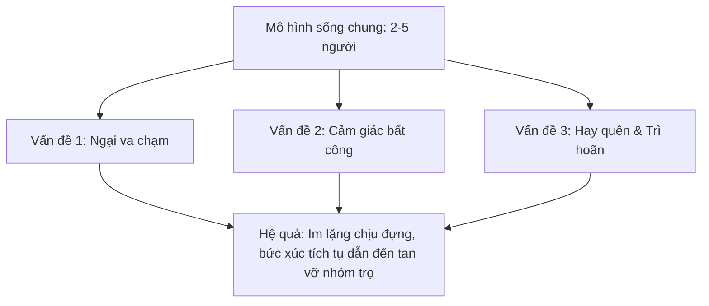
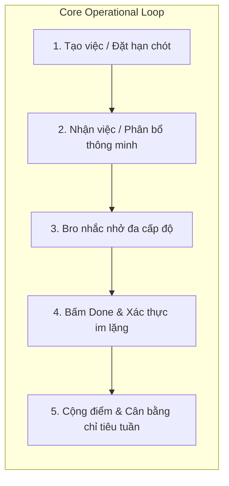
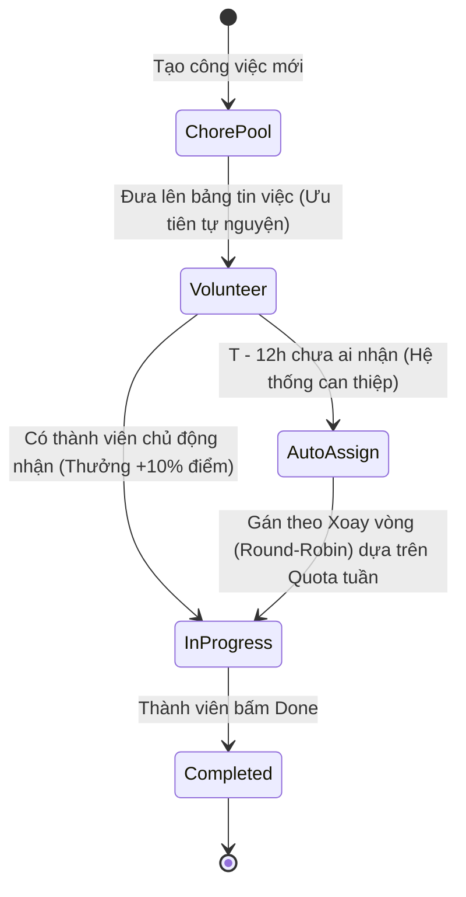
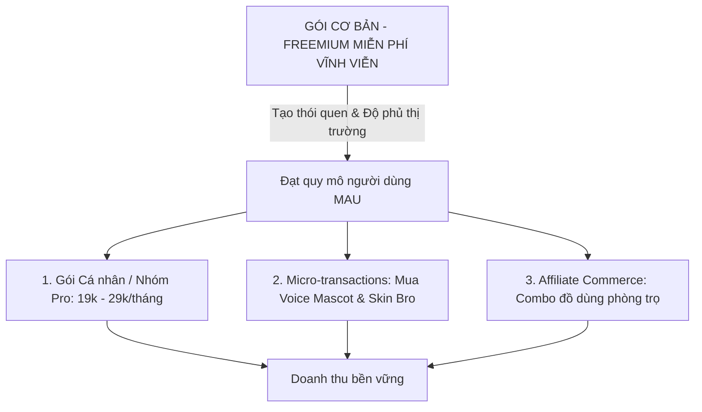

# TÀI LIỆU ĐẶC TẢ NGHIỆP VỤ SẢN PHẨM (PRODUCT SPECIFICATION / BRD)
# DỰ ÁN: DUE BRO — "BRO, IT'S DUE."

---

| Thông tin tài liệu | Chi tiết |
| :--- | :--- |
| **Dự án** | Due Bro — Ứng dụng Quản lý Cuộc sống Phòng trọ & Chia việc nhà thông minh |
| **Phiên bản** | 2.0 (Bản nâng cấp nghiệp vụ toàn diện) |
| **Trạng thái** | Sẵn sàng cho Thiết kế (UI/UX) & Phát triển (Dev Sprint) |
| **Bộ phận phụ trách** | Business Analyst & Product Team |
| **Cập nhật lần cuối** | 2026-09-14 |

---

## 1. TỔNG QUAN VÀ TẦM NHÌN SẢN PHẨM (PRODUCT VISION)

### 1.1 Tầm nhìn (Vision)
**Due Bro** định vị là **"Người bạn trung gian công tâm" (The Neutral Bro)** cho giới trẻ sống chung (ở trọ, căn hộ thuê chung, ký túc xá). Ứng dụng giải quyết triệt để những mâu thuẫn âm ỉ trong đời sống chung bằng cách số hóa trách nhiệm, tự động hóa việc nhắc nhở và biến nghĩa vụ nhàm chán thành trải nghiệm tương tác nhẹ nhàng, vui vẻ.

> **Slogan:** *"Bro, it's due."*  
> **Brand Persona:** Linh vật **Bro** — Người anh em phòng bên cool ngầu, đeo kính đen, hóm hỉnh, công bằng nhưng không ngại "cà khịa" nhắc nhở khi bạn trễ hạn.

### 1.2 Sứ mệnh cốt lõi (Core Mission)
1. **Xóa bỏ gánh nặng nhắc nhở trực tiếp:** Không ai trong phòng phải đóng vai "kẻ khó tính, hay cằn nhằn". Mọi lời nhắc đều xuất phát từ Mascot Bro.
2. **Minh bạch hóa & Định lượng hóa đóng góp:** Thay thế cảm giác chủ quan "tôi làm nhiều, bạn làm ít" bằng hệ thống điểm công việc minh bạch.
3. **Đồng bộ toàn diện cuộc sống trọ:** Tích hợp cả việc nhà định kỳ lẫn các hạn chót tài chính sống còn (tiền phòng, tiền điện, nước, hợp đồng thuê).

---

## 2. CHÂN DUNG NGƯỜI DÙNG & NỖI ĐAU (USER PERSONAS & PAIN POINTS)



### 2.1 Nhóm người dùng mục tiêu (Target Audiences)
1. **Sinh viên ở trọ / Ký túc xá (18 – 22 tuổi):** Ngân sách vừa phải, lịch học thất thường, chưa có thói quen tổ chức cuộc sống gia đình bài bản.
2. **Gen Z đi làm thuê chung căn hộ (22 – 27 tuổi):** Thời gian ở nhà ít, coi trọng sự riêng tư và minh bạch, sẵn sàng dùng công cụ số để tối ưu việc nhà.
3. **Người hướng nội / Ngại đối đầu (The Conflict-Averse Roommate):** Phân khúc khách hàng cốt lõi — cực kỳ ghét việc phải nhắn tin nhắc bạn cùng phòng dọn dẹp hoặc đóng tiền.

### 2.2 Các nỗi đau thực tế (Core Pain Points)
- **The "Nagger" Burden (Gánh nặng người nhắc nhở):** Người đứng ra nhắc nhở luôn bị xem là khó chịu, xét nét. Người bị nhắc thì cảm thấy bị sai bảo.
- **The Invisible Labor (Lao động vô hình):** Những việc vặt (mua giấy vệ sinh, đổ túi rác đầy, thay bóng đèn) thường không được ghi nhận, tạo sự ức chế cho người chủ động.
- **Deadline Quên Lãng:** Tiền điện, nước, internet bị quên đóng dẫn đến bị cắt dịch vụ hoặc bị chủ trọ phạt.

---

## 3. PHẠM VI SẢN PHẨM & MA TRẬN TÍNH NĂNG (SCOPE & MATRIX)

Để đảm bảo tính khả thi trong giai đoạn phát triển đầu tiên nhưng vẫn đồng nhất với bộ nhận diện thương hiệu (Design System), sản phẩm phân định phạm vi rõ ràng:

### 3.1 Phạm vi MVP (Giai đoạn 1 — In-Scope)
- **Module 1: Quản lý & Phân chia việc nhà thông minh (Smart Chore Engine)**.
- **Module 2: Hạn chót & Nhắc hóa đơn sinh hoạt định kỳ (Bill & Deadline Reminder)** *(Dạng sự kiện nhắc hạn chót, chưa xử lý giao dịch tiền)*.
- **Module 3: Hệ thống Mascot Bro & Giọng nhắc nhở (Bro Voice & Notification Engine)**.
- **Module 4: Hệ thống Điểm công sức, Hạn ngạch tuần & Bảng vinh danh (Karma & Weekly Quota)**.
- **Module 5: Quản trị nhóm phòng trọ cơ bản (Room & Member Management)**.

### 3.2 Ngoài phạm vi MVP (Giai đoạn 2 — Out-of-Scope)
- Cổng thanh toán trực tiếp / Chuyển tiền trong app.
- Phân chia tỷ lệ tiền lẻ phức tạp (OCR quét hóa đơn siêu thị).
- Chợ đồ cũ nội bộ giữa các phòng trọ.

---

## 4. CHI TIẾT CÁC PHÂN HỆ NGHIỆP VỤ (BUSINESS MODULES)



---

### PHÂN HỆ 1: QUẢN LÝ VIỆC NHÀ & PHÂN BỔ THÔNG MINH (SMART CHORES)

#### 1.1 Phân loại công việc (Task Categories)
1. **Việc định kỳ (Recurring Chores):** Lặp lại theo lịch (Ví dụ: Đổ rác mỗi tối 20:00, Rửa bát sau bữa ăn, Dọn WC vào thứ Bảy).
2. **Việc phát sinh / Khẩn cấp (Ad-hoc / SOS):** Phát sinh đột xuất (Ví dụ: "Hết nước uống rồi", "Bóng đèn hành lang bị cháy").
3. **Hạn chót sinh hoạt (Life Deadlines):** Nhắc việc quan trọng không phân chia làm việc (Ví dụ: "Tiền phòng hạn ngày 05", "Tiền điện nước hạn ngày 10").

#### 1.2 Bảng trọng số công việc chuẩn (Default Effort & Score Matrix)
Hệ thống cung cấp sẵn bảng mẫu điểm chuẩn (người dùng có thể tùy biến nhưng có mức khuyến nghị để tránh tranh cãi):

| Công việc mẫu | Tần suất gợi ý | Thời gian ước tính | Điểm chuẩn (Effort Point) |
| :--- | :--- | :--- | :--- |
| **Đổ rác & thay túi mới** | Hàng ngày | 5 phút | **5 pts** |
| **Rửa chén bát / dọn bếp** | Hàng ngày | 15 – 20 phút | **15 pts** |
| **Quét & Lau sàn nhà chung** | 2 – 3 ngày/lần | 20 – 30 phút | **20 pts** |
| **Cọ rửa nhà vệ sinh** | 1 lần/tuần | 30 – 45 phút | **35 pts** (Độ khó cao) |
| **Nấu ăn cho cả phòng** | Theo bữa | 45 – 60 phút | **30 pts** |
| **Tổng vệ sinh phòng cuối tuần** | 2 tuần/lần | 60 – 90 phút | **50 pts** |
| **Thay bình nước / Mua đồ chung** | Phát sinh | 10 phút | **10 pts** |

#### 1.3 Thuật toán phân bổ công việc (Allocation Logic)
Hệ thống **không áp dụng** cơ chế "gán mù quáng cho người ít điểm" (vì sẽ dẫn đến việc người lười tiếp tục ngâm việc). Thay vào đó, áp dụng **Quy chế 3 bước cân bằng**:



1. **Bước 1 — Bảng nhận việc tự nguyện (Bounty Board):** Mọi việc định kỳ được đưa lên bảng chung trước `24h`. Thành viên nào chủ động nhận làm sẽ được **thưởng thêm 10% điểm**.
2. **Bước 2 — Hạn ngạch trách nhiệm tuần (Weekly Quota):** Mỗi thành viên có chỉ tiêu điểm cần đạt trong tuần (Ví dụ: 60 điểm/người/tuần).
3. **Bước 3 — Điều phối tự động (Fallback Auto-Assignment):** Đến mốc `T - 12h` trước hạn chót mà chưa ai nhận, Bro sẽ tự động gán việc theo thứ tự ưu tiên:
   - Thành viên chưa đạt chỉ tiêu điểm tuần đó.
   - Luân phiên xoay vòng (Round-Robin) với những người cùng tiến độ.
   - Loại trừ thành viên đang bật chế độ `Away Mode` (Tạm vắng).

---

### PHÂN HỆ 2: LINH VẬT "BRO" & HỆ THỐNG THÔNG BÁO (BRO VOICE & NOTIFICATIONS)

Linh vật Bro là "vũ khí thương hiệu" giúp giảm bớt căng thẳng. Thông báo không khô khan như app nhắc việc thông thường mà mang cá tính của một người bạn cùng phòng:

#### 2.1 Ma trận leo thang nhắc nhở (Escalation Tone Levels)

| Mốc thời gian | Cấp độ (Severity) | Trạng thái Mascot | Thông điệp mẫu từ Bro |
| :--- | :--- | :--- | :--- |
| **Trước hạn 2h** | Nhắc nhở thân thiện (Friendly Nudge) | Đeo kính râm, cười tươi | *"Bro ơi, lát nhớ đổ rác trước 21h nhé. Easy 5 points!"* |
| **Đúng hạn chót** | Nghiêm túc nhẹ (Due Alert) | Mở to mắt, chỉ tay | *"Bro, it's due! Đến giờ dọn bếp rồi kìa, làm nhanh còn nghỉ ngơi!"* |
| **Trễ hạn 2h – 6h** | Cà khịa hài hước (Sarcastic Nudge) | Đội mũ ngược, thở dài `💀` | *"Bro... mày tính để đĩa mọc nấm men mới rửa hả Bro? Vào xác nhận đi nè!"* |
| **Trễ hạn > 12h** | Cảnh báo khẩn cấp (Emergency SOS) | Báo động đỏ | *"Task này đang bị 'đóng băng' rồi. Ai trong phòng giải cứu task này được x1.5 điểm luôn nhé!"* |

#### 2.2 Quy tắc ẩn danh bảo vệ tình bạn (Anonymity Shield)
- Khi một thành viên cảm thấy bạn mình làm việc chưa sạch hoặc quên làm, họ bấm nút **"Bro ơi, nhắc nhẹ cái"** trên app.
- Bro sẽ chủ động phát thông báo đến người phụ trách. **Hệ thống tuyệt đối không để lộ danh tính người đã gửi yêu cầu nhắc**, loại bỏ 100% nguy cơ hiềm khích cá nhân.

---

### PHÂN HỆ 3: XÁC THỰC CÔNG VIỆC & CHỐNG GIAN LẬN (VERIFICATION RULES)

Để ngăn chặn việc tự bấm "Done" để tích điểm khống:

```
[Thành viên bấm Done] 
       │
       ├── Có yêu cầu ảnh? ──> (Bắt buộc chụp 1 ảnh hiện trường)
       │
       ▼
[Chuyển trạng thái: "Pending Approval" trong 6 giờ]
       │
       ├── Trong 6h: Không ai khiếu nại ──> Tự động Duyệt & Cộng điểm chính thức
       │
       └── Trong 6h: Có người bấm "Chưa sạch" 
                 │
                 ▼
       [Bro thông báo khéo léo yêu cầu kiểm tra lại, chưa cộng điểm]
```

1. **Cơ chế Phê duyệt ngầm (Silent Approval):**
   - Khi hoàn thành, điểm ở trạng thái `Tạm tính (Pending)`.
   - Trong vòng 6 giờ tiếp theo, nếu không có ai trong phòng phản hồi "Chưa sạch", hệ thống sẽ tự động xác nhận điểm chính thức.
2. **Xác thực hình ảnh (Photo Proof — Tùy chọn):**
   - Áp dụng cho các công việc có điểm số cao (≥ 30 điểm như dọn vệ sinh toilet, tổng dọn dẹp). Người làm chụp nhanh 1 tấm ảnh trước khi bấm hoàn tất.
3. **Quy tắc khiếu nại lịch sự (Gentle Dispute):**
   - Khi một người bấm "Chưa sạch", Bro sẽ gửi thông điệp trung gian: *"Bro ơi, phòng kiểm tra thấy bồn rửa hình như còn vài cái ly, Bro ngó qua xử lý nốt để nhận trọn điểm nhé!"*.

---

### PHÂN HỆ 4: CHU KỲ ĐIỂM, QUY ĐỔI & VINH DANH (POINT & ECONOMY LIFECYCLE)

Để điểm số không bị lạm phát hay mất giá trị sau thời gian dài:

#### 4.1 Tách biệt hai loại điểm (Dual-Currency System)
1. **Effort Score (Điểm trách nhiệm tuần):**
   - **Chu kỳ:** Reset về 0 vào 00:00 sáng thứ Hai hàng tuần.
   - **Mục đích:** Đo lường mức độ hoàn thành chỉ tiêu tuần đó của từng người. Ai đạt chỉ tiêu sẽ nhận danh hiệu *"Tuần này Bro uy tín"*.
2. **Bro Karma (Điểm uy tín vĩnh viễn):**
   - **Chu kỳ:** Tích lũy không giới hạn thời gian.
   - **Mục đích:** Thể hiện độ tin cậy của một người bạn cùng phòng qua nhiều tháng/năm.
   - **Ứng dụng:** Mở khóa các skin Mascot Bro độc quyền, huy hiệu danh dự, hoặc dùng để "miễn trừ nghĩa vụ" (sử dụng *Thẻ Miễn Làm Việc Nhà* khi tích đủ Karma).

#### 4.2 Thỏa thuận phần thưởng nội bộ phòng (Room Reward Contract)
App cho phép cả phòng thiết lập phần thưởng/phạt tự nguyện vào cuối tuần:
- *Ví dụ:* Người có điểm thấp nhất tuần sẽ khao trà sữa cho cả phòng / Người cao điểm nhất tuần được miễn toàn bộ việc nhà ngày Chủ nhật.

---

### PHÂN HỆ 5: QUẢN LÝ NGOẠI LỆ ĐỜI THƯỜNG (EDGE CASE HANDLING)

#### 5.1 Chế độ Tạm vắng (Away Mode)
- Dành cho thành viên về quê, đi công tác, thực tập xa nhà.
- **Hành vi hệ thống:**
  - Thành viên khai báo thời gian vắng mặt (Từ ngày... Đến ngày...).
  - Hệ thống đóng băng chỉ tiêu tuần và không gán việc tự động cho thành viên này trong giai đoạn đó.
  - Khối lượng việc nhà được chia đều lại cho các thành viên còn lại đang có mặt tại phòng.

#### 5.2 Đổi ca / Nhờ làm hộ (Task Swap & SOS Delegate)
- Khi một thành viên bận việc đột xuất (tăng ca, ôn thi):
  - Bấm nút **"Bro ơi, cứu bồ!" (SOS Swap)** trên task.
  - Task được đẩy lên bảng thông báo chung. Thành viên khác có thể bấm "Nhận làm hộ".
  - **Quy tắc điểm:** Người làm hộ nhận 100% điểm của task + nhận thêm điểm Karma hỗ trợ. Người nhờ vả không bị tính trễ hạn.

#### 5.3 Biến động thành viên (Member Onboarding & Offboarding)
- **Thành viên mới gia nhập:** Trong tuần đầu tiên áp dụng chính sách *"Tân binh"* (Chỉ tiêu điểm tuần giảm 50% để làm quen nếp sống phòng).
- **Thành viên rời phòng:** Bàn giao quyền Host (nếu là Trưởng phòng), hệ thống lưu trữ lịch sử đóng góp và tách khỏi phòng an toàn.

---

## 5. MA TRẬN PHÂN QUYỀN HỆ THỐNG (ROLE-BASED ACCESS CONTROL)

| Chức năng | Trưởng phòng (Room Host) | Thành viên (Room Member) |
| :--- | :---: | :---: |
| Tạo phòng, tạo mã mời QR/Link | ✅ | ❌ |
| Thêm việc nhà định kỳ & gán điểm chuẩn | ✅ | ✅ (Cần Host duyệt) |
| Nhận việc, làm việc, bấm Done | ✅ | ✅ |
| Bật chế độ Tạm vắng (Away Mode) | ✅ | ✅ |
| Cài đặt hạn chót hóa đơn (Tiền điện, nước, phòng) | ✅ | ✅ |
| Chỉnh sửa cài đặt phòng / Đổi tên linh vật | ✅ | ❌ |
| Mời thành viên ra khỏi phòng | ✅ | ❌ |

---

## 6. MÔ HÌNH KINH DOANH & TỐI ƯU HÓA TRẢI NGHIỆM (BUSINESS MODEL & MONETIZATION)

Nhằm tháo gỡ rào cản tâm lý *"không ai muốn đứng ra trả 29.000đ cho cả phòng"*, mô hình kinh doanh được cấu trúc theo 3 tầng doanh thu:



1. **Gói Free Core (Phòng tối đa 4 người):** Miễn phí vĩnh viễn tính năng chia việc, bảng điểm và nhắc nhở cơ bản. Đảm bảo tăng trưởng tự nhiên (Viral Growth) trong cộng đồng sinh viên.
2. **Gói Bro Pro (Theo tháng/năm):**
   - Hỗ trợ phòng trọ đông người (> 5 người).
   - Mở khóa toàn bộ kho giọng nhắc nhở (Bro giọng Cà khịa, Bro giọng Tổng tài, Bro Anime, Bro Miền Tây...).
   - Lưu trữ lịch sử đóng góp vô hạn và xuất báo cáo sinh hoạt phòng.
3. **Affiliate Commerce (Tiềm năng doanh thu cao nhất):**
   - Khi công việc *"Hết nước rửa chén"*, *"Hết túi rác"*, *"Hết giấy vệ sinh"* được tạo, ứng dụng tích hợp nút **"Đặt nhanh combo phòng trọ"** liên kết Shopee / TikTok Shop / GrabMart để hưởng hoa hồng đơn hàng.

---

## 7. YÊU CẦU PHI CHỨC NĂNG (NON-FUNCTIONAL REQUIREMENTS)

1. **Hiệu năng & Thông báo thời gian thực (Real-time & Push Reliability):**
   - Tỷ lệ gửi thành công Push Notification đạt ≥ 99.5%. Nhắc nhở phải đến đúng giờ hẹn (sai lệch không quá 60 giây).
2. **Trải nghiệm thị giác & Nhịp điệu tương tác (UI/UX Feel):**
   - Thiết kế theo phong cách Gen Z năng động: Tông màu tím `#7C3AED` (Electric Purple), đen than `#181818`, trắng kem `#FAFAF9` (Đúng chuẩn [design.jpg](file:///E:/2026/due_bro/docs/design.jpg)).
   - Thao tác xác nhận hoàn thành công việc không quá 2 lần chạm.
3. **Bảo mật & Quyền riêng tư (Privacy & Room Isolation):**
   - Mọi dữ liệu về điểm số, hình ảnh xác nhận, lịch sử sinh hoạt chỉ được truy cập bởi các thành viên trong cùng một mã phòng trọ.

---

## 8. BỘ CHỈ SỐ ĐO LƯỜNG THÀNH CÔNG (NORTH STAR METRICS & KPIS)

| Nhóm chỉ số | Tên chỉ số | Mục tiêu kỳ vọng (Target) | Ý nghĩa nghiệp vụ |
| :--- | :--- | :--- | :--- |
| **Tương tác (Engagement)** | **Task Completion Rate** | ≥ 80% | Tỷ lệ công việc được tạo ra và hoàn thành thực tế. |
| **Độ đúng hạn (Reliability)** | **On-time Completion Rate** | ≥ 75% | Tỷ lệ việc hoàn thành trước hoặc đúng hạn chót. |
| **Gắn kết (Retention)** | **Room 30-Day Retention** | ≥ 60% | Tỷ lệ nhóm phòng trọ tiếp tục sử dụng app sau tháng đầu tiên. |
| **Tăng trưởng (Virality)** | **Viral Coefficient (K-factor)** | ≥ 1.2 | Mỗi phòng trọ mời thêm ít nhất 1 bạn bè lập phòng mới. |
